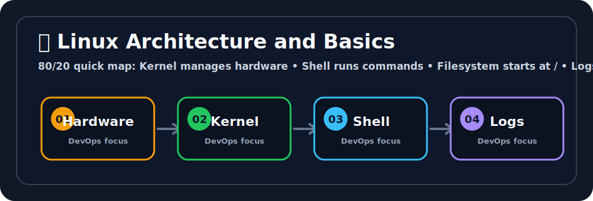

# 🐧 Linux Architecture and Basics


## 🖼️ Quick Visual Summary



> **⚡ 80/20 Summary:** Kernel manages hardware • Shell runs commands • Filesystem starts at / • Logs reveal failures

## 1. 🎯 Overview
Linux is an open-source, Unix-like operating system kernel that serves as the core interface between a computer's hardware and its processes. It is the bedrock of modern server infrastructure, cloud computing, containers, and CI/CD systems. 

## 2. 💡 Why This Matters
- **Industry Standard:** Over 90% of the world's public cloud workload and containerized applications (like Docker) run on Linux.
- **Resource Efficiency:** It runs natively without heavy graphical user interface (GUI) overhead, maximizing system resources for your applications.
- **Automation First:** Everything in Linux is a file, meaning the entire system can be managed and automated using simple text configurations and scripts.

## 3. 🧠 Core Concepts
- **Kernel:** The absolute core of the OS. It talks directly to the hardware (CPU, Memory, Disks).
- **Shell:** The command-line interface (e.g., `bash`, `zsh`) that takes your typed commands and translates them into Kernel instructions.
- **Daemons (Background Services):** Long-running processes that run in the background (like `sshd` for remote access or `systemd` for managing other services).
- **File System Hierarchy:** A unified tree structure. Everything starts at the root (`/`), differing from Windows which uses drive letters (`C:\`, `D:\`).

## 4. 🧭 Architecture / Workflow
1. **Hardware:** The physical or virtual CPU, RAM, and Disk.
2. **Kernel Space:** The Linux Kernel intercepts hardware requests and manages memory allocation.
3. **User Space:** The space where user applications run. When an application needs to read a file, it makes a "System Call" to the Kernel.
4. **Shell/Terminal:** A user space application that allows humans to interactively trigger system calls via commands.

## 5. 🛠️ Commands & Practical Usage

Find where you are currently located in the tree:
```bash
pwd
```
> *Stands for Print Working Directory.*

List files comprehensively with human-readable sizes:
```bash
ls -lah
```
> *`-l` (long format), `-a` (show hidden files), `-h` (human sizes like MB/GB).*

Find any file by its name globally:
```bash
find / -name "nginx.conf" 2>/dev/null
```
> *Searches from root (`/`). `2>/dev/null` hides "Permission denied" errors for a clean output.*

Read the last 100 lines of a log file in real-time:
```bash
tail -n 100 -f /var/log/syslog
```

## 6. ⚙️ Configuration / YAML / Code Examples
A simple Bash script (`bootstrap.sh`) to update a server and install basic utilities:

```bash
#!/bin/bash
# Always start with the shebang (path to the interpreter)

echo "Starting system update..."
# Update package repositories quietly via apt
apt-get update -yqq

echo "Installing curl and git..."
apt-get install curl git -y

echo "System bootstrap complete."
```

## 7. 🧪 Hands-on Step-by-Step

**Step 1: Navigate to the `tmp` directory**
```bash
cd /tmp
```

**Step 2: Create a nested directory structure in one command**
```bash
mkdir -p devops/project/logs
```

**Step 3: Create an empty file deep inside**
```bash
touch devops/project/logs/app.log
```

**Step 4: Append text into the file without opening an editor**
```bash
echo "Server started successfully." >> devops/project/logs/app.log
```

**Step 5: Verify the content**
```bash
cat devops/project/logs/app.log
```

## 8. 🚨 Common Errors & Troubleshooting

- **Error: `Command not found`**
  - **Issue:** The binary executable is not installed, or its path is not in your `$PATH` environment variable.
  - **Fix:** Install the tool (e.g., `apt install jq`) or use the absolute path (e.g., `/usr/local/bin/my-script`).
- **Error: `No space left on device`**
  - **Issue:** The disk is completely full.
  - **Fix:** Run `df -h` to see which partition is full, then run `du -sh /*` to find the bloated directories (usually `/var/log`).
- **Error: `Read-only file system`**
  - **Issue:** The disk has encountered hardware errors and mounted itself as read-only to prevent corruption.
  - **Fix:** Requires a filesystem check (`fsck`) and usually a reboot or disk replacement.

## 9. ✅ Best Practices
1. **Never run as root permanently:** Use a regular user account and prepend `sudo` to commands that require administrative privileges.
2. **Use tab completion:** Press `TAB` to auto-complete file paths and commands. It prevents agonizing typos.
3. **Use aliases for speed:** Add `alias ll='ls -la'` to your `~/.bashrc` to save keystrokes.

## 10. 🎤 Interview Questions & Answers

**Q1: What is the main difference between Linux and Windows file systems?**
**A1:** Linux uses a unified single-tree hierarchy starting at the root (`/`), and treats everything (including hardware devices) as a file. Windows uses separate graphical drives (`C:\`, `D:\`).

**Q2: What is the Kernel?**
**A2:** The central core of the operating system that directly interfaces with the hardware and manages memory, CPU, and processes.

**Q3: How would you search for the word "Exception" across all log files in a directory?**
**A3:** By using the grep command recursively: `grep -r "Exception" /var/log/my-app/`

**Q4: What is the `$PATH` variable?**
**A4:** It is an environment variable containing a colon-separated list of directories. When you type a command, the shell searches these directories to find the executable binary.

**Q5: What does `2>/dev/null` do at the end of a command?**
**A5:** It redirects Standard Error (File Descriptor 2) into the Linux "black hole" (`/dev/null`), effectively suppressing unwanted error messages from polluting the screen.

## 11. ⚡ Quick Revision Summary
- **Linux** is the backbone of cloud and container computing.
- **Root (`/`)** is the beginning of the file system.
- Everything is treated as a file, highly enabling automation.
- `ls`, `cd`, `grep`, `find`, and `tail` are your bread-and-butter commands.

## 12. 🔗 Official Documentation Links
- [Linux Kernel Archives](https://www.kernel.org/)
- [GNU Bash Reference Manual](https://www.gnu.org/software/bash/manual/)
