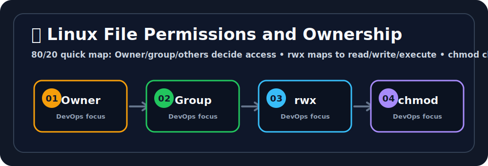

# 🔐 Linux File Permissions and Ownership

## 🖼️ Quick Visual Summary



> **80/20 Summary:** permissions decide access, ownership decides who controls the file, and `chmod` / `chown` keep things safe. 🛡️

## 1. Big Picture

Ravi, this is one of the most important Linux topics for real work.

Permissions exist because not everyone should be able to read, change, or run every file.
That matters for security, stability, and teamwork.

Without permissions, any user could modify system files, steal secrets, or break applications by accident.

## 2. Real-Life Analogy

Ravi, think of a house with keys and rooms 🏠

- **owner** = the person who owns the house
- **group** = family members who can access some rooms
- **others** = visitors outside the family
- **read** = look inside
- **write** = change things
- **execute** = walk through the door and use the room

That is exactly how Linux permissions feel.

## 3. Technical Definition

Linux file permissions control which users can read, write, or execute files and directories based on ownership and access bits.

## 4. Internal Working

```text
User tries to access file
   |
   v
Linux checks owner / group / others
   |
   v
Linux checks rwx bits
   |
   +--> allowed -> operation succeeds
   |
   +--> denied  -> permission error
```

### Permission Breakdown

| Part | Meaning |
| --- | --- |
| User (`u`) | File owner 👤 |
| Group (`g`) | Users in the same group 👥 |
| Others (`o`) | Everyone else 🌍 |
| Read (`r`) | View contents 👀 |
| Write (`w`) | Modify contents ✍️ |
| Execute (`x`) | Run a file or enter a directory 🚀 |

## 5. Key Concepts

| Concept | Meaning |
| --- | --- |
| Ownership | Which user and group control the file 🧾 |
| Mode bits | The rwx permission values 🔢 |
| `chmod` | Change permissions 🔧 |
| `chown` | Change owner and group 👑 |
| `umask` | Default permission mask when new files are created 🛡️ |
| `root` | Superuser who can override many permission limits 🔥 |

## 6. Commands

| Command | Why we use it | What happens internally |
| --- | --- | --- |
| `ls -l` | Inspect permissions | Shows mode bits, owner, and group |
| `chmod 755 script.sh` | Make a script runnable | Updates the file’s permission bits |
| `chmod +x deploy.sh` | Add execute permission | Grants execute without changing other bits |
| `chown ubuntu:www-data config.yaml` | Change ownership | Updates the file’s user and group owner |
| `chmod -R 644 /var/www/html/` | Fix permissions in a tree | Applies permission changes recursively |

## 7. Real Production Usage

Ravi, this is where permissions matter in real projects:

- SSH keys must be private
- config files often need restricted access
- scripts need execute permission
- service files and secrets should not be world-readable

Good permissions can save you from a security incident.

## 8. Common Mistakes

- ❌ Making everything `777`
  - Why it is wrong: everyone can read, write, and execute everything.
  - ✅ Correct: give only the access that is needed.

- ❌ Forgetting directories need execute permission
  - Why it is wrong: you cannot enter a directory without `x`.
  - ✅ Correct: think of `x` on directories as "can enter."

- ❌ Changing ownership when permissions were the real issue
  - Why it is wrong: ownership and permission are different problems.
  - ✅ Correct: check both before changing anything.

## 9. Best Practices

1. Use least privilege.
2. Keep secrets private.
3. Use groups for shared access.
4. Be careful with recursive changes.
5. Understand the difference between files and directories.

## 10. Interview Corner

Ravi, your interviewer might ask this. 🎤

**Q1: What does `chmod` do?**
A1: It changes file permissions.

**Q2: What does `chown` do?**
A2: It changes file ownership.

**Q3: What do `r`, `w`, and `x` mean?**
A3: Read, write, and execute.

**Q4: Why is `x` important on a directory?**
A4: It lets you enter or access that directory.

**Q5: Why is `777` dangerous?**
A5: It gives everyone full access.

## 11. Revision Summary

- Owner, group, others 👤👥🌍
- `rwx` = read, write, execute 🔐
- `chmod` changes permissions 🔧
- `chown` changes ownership 👑
- `root` can override many restrictions 🚨

## 12. Key Takeaways

- Permissions protect files.
- Ownership decides who controls them.
- `x` means different things for files and directories.
- Use least privilege by default.

## 13. Comparison Table

| `chmod` | `chown` |
| --- | --- |
| Changes permission bits | Changes owner/group |
| Controls what users can do | Controls who owns the file |
| Used for access management | Used for ownership management |

## 14. Memory Tricks

- **r = read**
- **w = write**
- **x = execute**
- **u = user**
- **g = group**
- **o = others**

## 15. Official Docs

- [chmod Manual](https://man7.org/linux/man-pages/man1/chmod.1.html)
- [chown Manual](https://man7.org/linux/man-pages/man1/chown.1.html)
