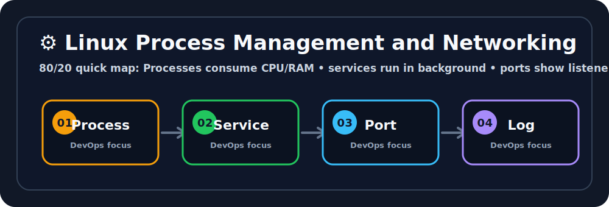

# ⚙️ Linux Process Management and Networking

## 🖼️ Quick Visual Summary



> **80/20 Summary:** processes use CPU and RAM, ports identify listeners, and logs explain what went wrong. 🧩

## 1. Big Picture

Ravi, this is the Linux topic that saves you during incidents.

Applications run as processes.
Those processes consume resources, listen on ports, and sometimes fail in ways that only logs can explain.

If you can find the process, inspect the port, and read the logs, you can debug most server problems. 💪

## 2. Real-Life Analogy

Ravi, think of a busy office building 🏢

- each **process** is a worker
- the **PID** is the worker ID card
- a **port** is the desk number
- `top` is the live office dashboard
- `kill` is asking a worker to stop

That makes troubleshooting much easier to picture.

## 3. Technical Definition

Linux processes are running instances of programs managed by the kernel, and networking tools help you inspect how those processes bind to ports and communicate over the network.

## 4. Internal Working

```text
Program starts
   |
   v
Kernel creates a process
   |
   v
Process gets a PID and memory
   |
   v
Process binds to a port
   |
   v
Requests arrive at that port
   |
   v
Logs show what happened
```

## 5. Key Concepts

| Concept | Meaning |
| --- | --- |
| Process | A running program 🏃 |
| PID | Process ID number 🔢 |
| Daemon | Background service that keeps running 🔄 |
| Port | A network door for a service 🚪 |
| Socket | The endpoint used for network communication 🌐 |
| SIGTERM | Gentle stop request 🙏 |
| SIGKILL | Forceful stop request 💥 |

## 6. Commands

| Command | Why we use it | What happens internally |
| --- | --- | --- |
| `top` | Watch resource usage live | Streams CPU and memory usage per process |
| `ps aux | grep java` | Find a process | Lists processes and filters by name |
| `kill <pid>` | Stop politely | Sends `SIGTERM` |
| `kill -9 <pid>` | Stop forcefully | Sends `SIGKILL` |
| `ss -tulnp` | See listening ports | Shows sockets bound to ports |
| `netstat -tulpn` | Older port inspection tool | Displays network listeners |

## 7. Real Production Usage

Ravi, this is what happens in real companies:

- you investigate a CPU spike
- you find the process consuming resources
- you check which port it is holding
- you stop only the broken service
- you read logs to confirm the root cause

That workflow is pure DevOps gold.

## 8. Common Mistakes

- ❌ Killing the wrong PID
  - Why it is wrong: you may stop an important service.
  - ✅ Correct: confirm the process name before killing it.

- ❌ Using `kill -9` first
  - Why it is wrong: it does not let the process clean up.
  - ✅ Correct: try `kill` first, then escalate.

- ❌ Ignoring logs
  - Why it is wrong: logs often explain the real problem.
  - ✅ Correct: check logs after checking the process.

## 9. Best Practices

1. Use `top` or `htop` for live monitoring.
2. Prefer gentle shutdown first.
3. Check who owns a port before restarting services.
4. Use logs to confirm your theory.
5. Learn `ss` for modern port debugging.

## 10. Interview Corner

Ravi, your interviewer might ask this. 🎤

**Q1: What is a process?**
A1: A running instance of a program.

**Q2: What is a PID?**
A2: The unique process ID assigned by the kernel.

**Q3: What does `kill` do?**
A3: Sends a signal to a process, usually a stop request.

**Q4: Why is `kill -9` dangerous?**
A4: It forcefully stops the process without cleanup.

**Q5: Why is `ss` useful?**
A5: It shows which processes are listening on ports.

## 11. Revision Summary

- Process = running program 🏃
- PID = process ID 🔢
- Port = network door 🚪
- `kill` = gentle stop 🙏
- Logs = troubleshooting evidence 🪵

## 12. Key Takeaways

- Processes consume system resources.
- Ports show where services listen.
- Logs help explain failures.
- Use gentle signals before force.

## 13. Comparison Table

| `kill` | `kill -9` |
| --- | --- |
| Gentle stop | Forceful stop |
| Lets process clean up | Stops immediately |
| Preferred first | Use only when needed |

## 14. Memory Tricks

- **PID = process ID**
- **Port = door**
- **Logs = clues**
- **`kill` = ask nicely**
- **`kill -9` = emergency button**

## 15. Official Docs

- [top Manual](https://man7.org/linux/man-pages/man1/top.1.html)
- [ss Manual](https://man7.org/linux/man-pages/man8/ss.8.html)
