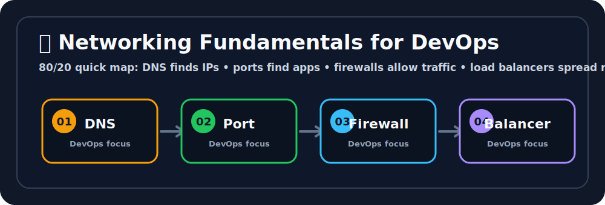

# 🌐 Networking Fundamentals for DevOps

## 🖼️ Quick Visual Summary



> **80/20 Summary:** DNS finds names, ports find apps, firewalls decide who gets in, and load balancers share the traffic. 🚦

## 1. Big Picture

Ravi, this is the foundation of everything that talks over the network.

Networking connects users, servers, containers, Kubernetes clusters, cloud services, and CI/CD systems.
When something fails, it often looks like a networking problem first.

Before you panic, remember: networking is just moving a request from point A to point B safely.

## 2. Real-Life Analogy

Ravi, think of networking like sending a package 📦

- the **address** is the IP
- the **apartment number** is the port
- the **address book** is DNS
- the **security guard** is the firewall
- the **delivery dispatcher** is the load balancer

If any one of those is wrong, the package does not arrive.

## 3. Technical Definition

Networking is the set of protocols, addresses, routes, and rules that allow systems to communicate over local or wide-area networks.

## 4. Internal Working

```text
User
  |
  v
DNS resolves name
  |
  v
Traffic reaches IP
  |
  v
Firewall checks rules
  |
  v
Port forwards to app
  |
  v
Response returns to user
```

## 5. Key Concepts

| Concept | Meaning |
| --- | --- |
| IP address | Unique network address of a machine 🌍 |
| Subnet | A smaller range inside a network 🧩 |
| Port | Door to a specific application 🚪 |
| Protocol | Rules for communication 📜 |
| DNS | Turns names into IP addresses 🔎 |
| Firewall | Allows or blocks traffic 🛡️ |
| Routing | Decides where packets go next 🛣️ |
| Load balancer | Spreads traffic across healthy backends ⚖️ |

## 6. Commands

| Command | Why we use it | What happens internally |
| --- | --- | --- |
| `ping google.com` | Check reachability | Sends ICMP echo requests |
| `dig example.com` | Inspect DNS | Queries DNS records directly |
| `nslookup example.com` | Basic DNS lookup | Resolves a name to an IP |
| `curl -I https://example.com` | Check HTTP headers | Sends a request and prints headers |
| `ss -tulnp` | See listening ports | Shows sockets and owning processes |

## 7. Real Production Usage

Ravi, this is how networking shows up in real projects:

- an app behind a load balancer
- Kubernetes Services exposing Pods
- DNS records pointing to cloud resources
- security groups or firewalls controlling traffic

If you can reason about the path of a request, you can debug much faster.

## 8. Common Mistakes

- ❌ Mixing up DNS and IP
  - Why it is wrong: DNS is the name resolver, not the destination itself.
  - ✅ Correct: DNS gives you the IP, then traffic goes to the IP.

- ❌ Opening every port
  - Why it is wrong: it creates unnecessary risk.
  - ✅ Correct: allow only what you need.

- ❌ Forgetting load balancers need healthy backends
  - Why it is wrong: traffic still fails if nothing healthy exists behind it.
  - ✅ Correct: check backend health first.

## 9. Best Practices

1. Understand the request path.
2. Check DNS before anything else.
3. Confirm the port and firewall rules.
4. Use load balancers for shared traffic.
5. Keep network rules as small as possible.

## 10. Interview Corner

Ravi, your interviewer might ask this. 🎤

**Q1: What is an IP address?**
A1: A unique network address for a machine or interface.

**Q2: What is DNS?**
A2: A system that translates names into IP addresses.

**Q3: What is a port?**
A3: A network door for a specific application.

**Q4: What does a firewall do?**
A4: It allows or blocks traffic based on rules.

**Q5: Why use a load balancer?**
A5: To distribute traffic across healthy backends.

## 11. Revision Summary

- IP = address 🌍
- Port = app door 🚪
- DNS = name to IP 🔎
- Firewall = traffic guard 🛡️
- Load balancer = traffic splitter ⚖️

## 12. Key Takeaways

- Networking is the path of request traffic.
- DNS, ports, and firewalls are the core basics.
- Load balancers improve availability.
- Debugging is easier when you follow the path step by step.

## 13. Comparison Table

| DNS | Port | Firewall |
| --- | --- | --- |
| Resolves names | Identifies apps | Controls access |
| Works before connection | Works during connection | Works before app access |

## 14. Memory Tricks

- **DNS = name book**
- **Port = door number**
- **Firewall = guard**
- **Load balancer = traffic manager**

## 15. Official Docs

- [ICANN DNS Basics](https://www.icann.org/resources/pages/dns-what-is-it-2018-01-19-en)
- [MDN HTTP Overview](https://developer.mozilla.org/en-US/docs/Web/HTTP/Overview)
```

Trace the network path:
```bash
traceroute example.com
```

## 6. 🚨 Common Errors & Fixes
- **DNS not resolving:** check DNS record, nameserver, typo, or expired domain.
- **Connection refused:** server is reachable, but no process is listening on that port.
- **Connection timed out:** traffic is blocked, route is broken, or target is down.
- **TLS certificate error:** certificate expired, wrong hostname, or incomplete chain.
- **Works locally but not in cloud:** check security group, subnet route table, NACL, and application bind address.

## 7. 🎤 Interview Questions

**Q1: What is the difference between TCP and UDP?**  
TCP is connection-oriented and reliable. UDP is faster but does not guarantee delivery.

**Q2: What happens when you open `https://example.com`?**  
DNS resolves the domain, the client connects to the server on port `443`, TLS handshake happens, then HTTP request/response flows.

**Q3: What does `connection refused` mean?**  
The host is reachable, but the target port has no service listening or actively rejected the request.

**Q4: What is a load balancer?**  
A component that distributes traffic across multiple healthy backends to improve availability and scalability.

## 8. ⚡ Quick Revision
- DNS gives the IP.
- Ports identify the application.
- Firewalls decide what is allowed.
- Routing decides where traffic goes.
- Load balancers distribute traffic.
- Use `curl`, `dig`, `ss`, and `traceroute` first while debugging.
