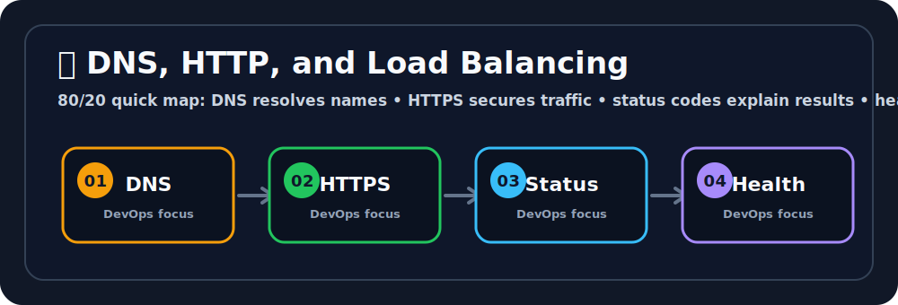

# 🔎 DNS, HTTP, and Load Balancing


## 🖼️ Quick Visual Summary



> **⚡ 80/20 Summary:** DNS resolves names • HTTPS secures traffic • status codes explain results • health checks protect uptime

## 1. 🎯 Overview
DNS, HTTP/HTTPS, and load balancing are the request path basics behind almost every DevOps deployment. If users cannot reach the app, this is where you start.

## 2. 🔎 DNS Essentials
- **A record:** maps domain to IPv4 address.
- **AAAA record:** maps domain to IPv6 address.
- **CNAME record:** aliases one domain to another domain.
- **TXT record:** stores text values, commonly used for verification and email security.
- **TTL:** how long DNS answers are cached.

## 3. 🌍 HTTP Essentials
- **GET:** read data.
- **POST:** create or submit data.
- **PUT/PATCH:** update data.
- **DELETE:** remove data.
- **2xx:** success.
- **3xx:** redirect.
- **4xx:** client-side issue.
- **5xx:** server-side issue.

## 4. 🔐 HTTPS Essentials
HTTPS is HTTP over TLS. It protects traffic using encryption and verifies server identity using certificates.

Common TLS checks:
```bash
curl -v https://example.com
openssl s_client -connect example.com:443 -servername example.com
```

## 5. ⚖️ Load Balancing Essentials
- **Layer 4 load balancer:** routes TCP/UDP traffic without understanding HTTP content.
- **Layer 7 load balancer:** understands HTTP paths, hosts, headers, and cookies.
- **Health check:** detects unhealthy backends and stops sending traffic to them.
- **Sticky session:** keeps a user tied to the same backend when needed.

## 6. 🧭 Real DevOps Flow
```text
Domain -> DNS -> Load Balancer -> Ingress / Reverse Proxy -> App Pods / Servers
```

## 7. 🚨 Troubleshooting Checklist
- Does DNS resolve to the expected target?
- Is the load balancer healthy?
- Are backend targets healthy?
- Is port `80` or `443` allowed?
- Is the certificate valid for the hostname?
- Are app logs showing requests?

## 8. ⚡ Quick Revision
- DNS finds the destination.
- HTTP carries the request.
- HTTPS secures the request.
- Load balancers keep apps available.
- Health checks decide where traffic should go.

