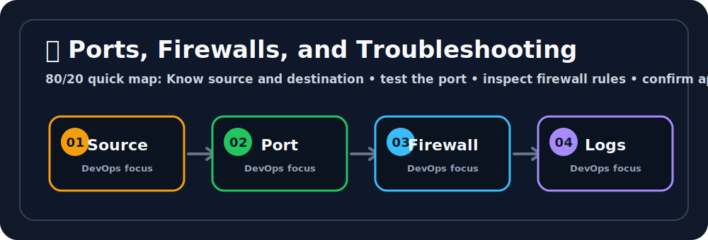

# 🧱 Ports, Firewalls, and Troubleshooting

## 🖼️ Quick Visual Summary



> **80/20 Summary:** know the port, check the firewall, and follow the request path until you find the block. 🛠️

## 1. Big Picture

Ravi, this is the page that saves you during incidents.

When an app is unreachable, the problem is often one of three things:

- the port is closed
- the firewall blocks traffic
- the app is not listening

If you learn how to test those three, you can debug faster than most beginners.

## 2. Real-Life Analogy

Ravi, think of a building entrance with guards and room numbers 🏢

- the **port** is the room number
- the **firewall** is the security guard
- troubleshooting is you checking each door until you find the locked one

## 3. Technical Definition

Ports identify applications on a host, firewalls enforce traffic rules, and troubleshooting is the process of systematically finding where connectivity fails.

## 4. Internal Working

```text
Client sends request
   |
   v
DNS resolves host
   |
   v
Firewall checks rules
   |
   v
Port is checked
   |
   v
App receives traffic
   |
   v
Logs confirm the result
```

## 5. Key Concepts

| Concept | Meaning |
| --- | --- |
| Port | A service door number 🚪 |
| Inbound rule | Traffic coming in 📥 |
| Outbound rule | Traffic leaving 📤 |
| CIDR | IP range notation 📏 |
| Least privilege | Open only what you need 🔒 |
| Listener | A process waiting on a port 👂 |
| Timeout | No response in time ⏳ |

## 6. Commands

| Command | Why we use it | What happens internally |
| --- | --- | --- |
| `ss -tulnp` | See listening ports | Shows active sockets and owning processes |
| `nc -vz example.com 443` | Test TCP connectivity | Opens a quick TCP connection check |
| `curl -I https://example.com` | Test HTTP access | Sends an HTTP request and prints headers |
| `ping example.com` | Test basic reachability | Sends ICMP echo packets |
| `traceroute example.com` | Trace packet path | Shows hops between source and destination |

## 7. Real Production Usage

Ravi, this is how people use these skills in production:

- confirm a port is listening before blaming the app
- check firewall rules when a cloud service cannot be reached
- trace connectivity between microservices
- validate that only expected ports are exposed

## 8. Common Mistakes

- ❌ Opening a port but forgetting the app
  - Why it is wrong: the network may be open but nothing is listening.
  - ✅ Correct: confirm the service is actually running.

- ❌ Assuming ping means HTTP works
  - Why it is wrong: ICMP and HTTP are different.
  - ✅ Correct: test the actual application port and protocol.

- ❌ Allowing everything from everywhere
  - Why it is wrong: it weakens security.
  - ✅ Correct: use least privilege rules.

## 9. Best Practices

1. Check DNS first.
2. Confirm the port is open.
3. Verify the app is listening.
4. Read logs for the final clue.
5. Keep firewall rules tight.

## 10. Interview Corner

Ravi, your interviewer might ask this. 🎤

**Q1: What is a port?**
A1: A numbered entry point for an application.

**Q2: What is a firewall?**
A2: A rule system that allows or blocks traffic.

**Q3: Why use `ss`?**
A3: To see which processes are listening on which ports.

**Q4: What does `nc -vz` test?**
A4: TCP connectivity to a host and port.

**Q5: What is least privilege?**
A5: Allow only the minimum access needed.

## 11. Revision Summary

- Port = app door 🚪
- Firewall = traffic guard 🛡️
- Listener = process waiting 👂
- Timeout = no response ⏳
- Logs = final evidence 🪵

## 12. Key Takeaways

- Most debugging starts with port and firewall checks.
- Ping is not enough.
- Use logs to confirm what really happened.
- Keep network access minimal.

## 13. Comparison Table

| Port | Firewall | DNS |
| --- | --- | --- |
| Identifies the app | Controls traffic | Resolves the host |

## 14. Memory Tricks

- **Port = door**
- **Firewall = guard**
- **CIDR = IP block**
- **Logs = proof**

## 15. Official Docs

- [Linux `ss`](https://man7.org/linux/man-pages/man8/ss.8.html)
- [Cloudflare Traceroute Guide](https://www.cloudflare.com/learning/network-layer/what-is-traceroute/)
