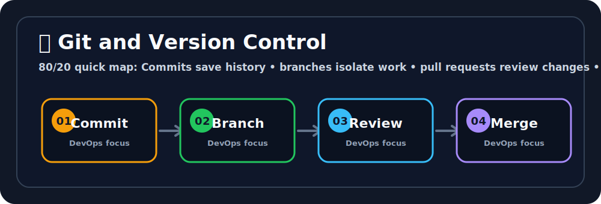

# 🌿 Git Fundamentals

## 🖼️ Quick Visual Summary



> **80/20 Summary:** commits save history, branches isolate work, pull requests review changes, and restore tools keep mistakes survivable. 📌

## 1. Big Picture

Ravi, Git exists because teams needed a better way to remember code changes.
Instead of manually copying files like `final_v2_really_final`, Git gives you a clean history of every meaningful change.

That matters because code changes over time, teams collaborate, and mistakes happen.

## 2. Real-Life Analogy

Ravi, think of Git like a notebook with revision history 📓

- each commit is a saved page
- each branch is a separate notebook tab
- the remote is the shared copy on the team shelf

You can go back, compare pages, or work on a new idea without ruining the old one.

## 3. Technical Definition

Git is a distributed version control system that tracks changes to files, stores history locally, and lets you branch, merge, and synchronize work with remotes.

## 4. Internal Working

```text
Working directory
   |
   | git add
   v
Staging area
   |
   | git commit
   v
Local Git repository
   |
   | git push
   v
Remote repository
```

## 5. Key Concepts

| Concept | Meaning |
| --- | --- |
| Repository | A project with its Git history 📦 |
| Commit | A saved snapshot of changes ✅ |
| Branch | A separate line of work 🌿 |
| Remote | Shared copy stored elsewhere 🌍 |
| Staging area | Changes waiting to be committed 🧺 |
| Merge | Combine branches 🔀 |
| Rebase | Reapply commits on a new base 🧼 |

## 6. Commands

| Command | Why we use it | What happens internally |
| --- | --- | --- |
| `git init` | Start Git in a folder | Creates the hidden `.git` metadata |
| `git status` | See what changed | Compares working tree, stage, and repo |
| `git diff` | Review modifications | Shows line-level differences |
| `git add .` | Stage changes | Moves changes into the staging area |
| `git commit -m "..."` | Save a snapshot | Writes a new commit object |
| `git log --oneline --graph --decorate` | View history | Displays commit ancestry |
| `git switch -c feature-login` | Create a branch | Moves HEAD to a new branch |
| `git restore app.py` | Undo local file changes | Replaces file with last committed version |
| `git push origin feature-login` | Send changes to remote | Uploads commits to the remote repo |

## 7. Real Production Usage

Ravi, this is how Git is used in real teams:

- code changes are committed in small pieces
- feature branches isolate work
- pull requests are reviewed before merge
- release tags mark production-ready versions

Git is also how DevOps teams keep infrastructure code and pipeline code under version control.

## 8. Common Mistakes

- ❌ Committing secrets
  - Why it is wrong: Git history is hard to erase.
  - ✅ Correct: keep secrets out of the repository.

- ❌ Making giant commits
  - Why it is wrong: they are hard to review and revert.
  - ✅ Correct: commit small logical changes.

- ❌ Rebasing shared history carelessly
  - Why it is wrong: it can confuse teammates.
  - ✅ Correct: rebase local work, not public shared history.

## 9. Best Practices

1. Commit small changes.
2. Write clear commit messages.
3. Use `.gitignore`.
4. Branch for each feature.
5. Protect `main`.

## 10. Interview Corner

Ravi, your interviewer might ask this. 🎤

**Q1: What is Git?**
A1: A distributed version control system.

**Q2: What is a commit?**
A2: A saved snapshot of the repository.

**Q3: What is the staging area?**
A3: The place where changes wait before commit.

**Q4: What is the difference between merge and rebase?**
A4: Merge combines histories; rebase replays commits on a new base.

**Q5: Why use `.gitignore`?**
A5: To keep unwanted or sensitive files out of Git history.

## 11. Revision Summary

- Git stores history locally 🗂️
- Branches isolate work 🌿
- Commits capture snapshots 📸
- Remotes share work 🌍
- `.gitignore` keeps noise out 🚫

## 12. Key Takeaways

- Git is your code history system.
- Branches let you experiment safely.
- Commits should stay small and clear.
- Git history is powerful, so treat it carefully.

## 13. Comparison Table

| Commit | Branch |
| --- | --- |
| Saves a snapshot | Separates work |
| Permanent history point | Temporary line of work |
| Used to record progress | Used to organize development |

## 14. Memory Tricks

- **Commit = checkpoint**
- **Branch = side road**
- **Remote = shared shelf**
- **Staging = waiting room**

## 15. Official Docs

- [Pro Git Book](https://git-scm.com/book/en/v2)
- [Git Branching Basics](https://git-scm.com/book/en/v2/Git-Branching-Basic-Branching-and-Merging)
