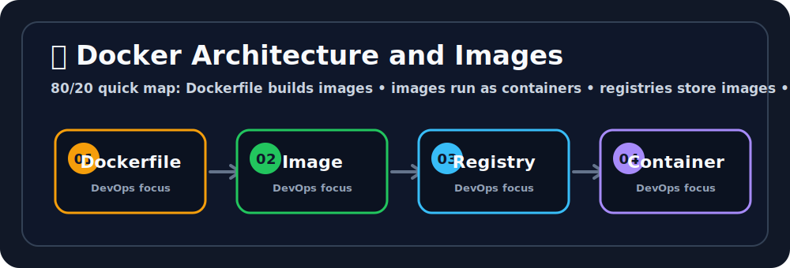

# 🐳 Docker Architecture and Images

## 🖼️ Quick Visual Summary



> **80/20 Summary:** Dockerfile builds images, images become containers, registries store images, and smaller images ship faster. 📦

## 1. Big Picture

Ravi, Docker was created to solve the classic "it works on my machine" problem.

Tiny joke: Docker makes apps portable because apps are terrible at packing themselves. 📦😄

It lets you package an app with everything it needs so the app behaves the same on your laptop, a test server, or a cloud VM.

## 2. Real-Life Analogy

Ravi, think of Docker like a sealed shipping box 📦

- the **Dockerfile** is the packing list
- the **image** is the sealed box
- the **container** is the box being delivered and opened
- the **registry** is the warehouse

## 3. Technical Definition

Docker is a container platform that packages software and its dependencies into images and runs those images as isolated containers.

## 4. Internal Working

```text
Dockerfile
   |
   | docker build
   v
Image
   |
   | docker run
   v
Container
```

## 5. Key Concepts

| Concept | Meaning |
| --- | --- |
| Docker Engine | The service that creates and runs containers ⚙️ |
| Dockerfile | The blueprint for the image 🧾 |
| Image | Read-only packaged application 📦 |
| Container | Running instance of an image 🚀 |
| Registry | Place where images are stored ☁️ |
| Layer | A reusable build step 🧱 |

## 6. Commands

| Command | Why we use it | What happens internally |
| --- | --- | --- |
| `docker build -t my-python-app:v1.0 .` | Build an image | Reads the Dockerfile and creates layers |
| `docker images` | See local images | Lists stored images on the machine |
| `docker push username/my-python-app:v1.0` | Upload image | Sends the image to a registry |
| `docker rmi my-python-app:v1.0` | Remove an image | Deletes the local image reference |

## 7. Real Production Usage

Ravi, Docker shows up everywhere:

- app packaging
- CI/CD pipelines
- microservices
- local development
- containerized deployments

## 8. Common Mistakes

- ❌ Building giant images
  - Why it is wrong: they are slower to download and deploy.
  - ✅ Correct: keep images small.

- ❌ Putting secrets in the Dockerfile
  - Why it is wrong: secrets can leak into image history.
  - ✅ Correct: inject secrets at runtime.

- ❌ Running as root by default
  - Why it is wrong: it increases risk.
  - ✅ Correct: use a non-root user when possible.

## 9. Best Practices

1. Use small base images.
2. Use multi-stage builds.
3. Tag images clearly.
4. Avoid hardcoding secrets.
5. Rebuild when dependencies change.

## 10. Interview Corner

Ravi, your interviewer might ask this. 🎤

**Q1: What is a Docker image?**
A1: A read-only package that contains an app and its dependencies.

**Q2: What is a Docker container?**
A2: A running instance of an image.

**Q3: What is a Dockerfile?**
A3: A file that defines how to build an image.

**Q4: Why use multi-stage builds?**
A4: To keep production images smaller and cleaner.

**Q5: What is a registry?**
A5: A storage location for Docker images.

## 11. Revision Summary

- Dockerfile = blueprint 🧾
- Image = packaged app 📦
- Container = running app 🚀
- Registry = image warehouse ☁️
- Smaller images are better ✨

## 12. Key Takeaways

- Docker makes apps portable.
- Images are built from Dockerfiles.
- Containers run images.
- Keep images small and safe.

## 13. Comparison Table

| Image | Container |
| --- | --- |
| Read-only template | Running instance |
| Built once | Started many times |
| Stored in registry | Runs on host |

## 14. Memory Tricks

- **Dockerfile = recipe**
- **Image = meal prep**
- **Container = served meal**
- **Registry = pantry**

## 15. Official Docs

- [Docker Docs](https://docs.docker.com/)
- [Dockerfile Reference](https://docs.docker.com/reference/dockerfile/)

**Step 1: Create a tiny application structure**
```bash
mkdir docker-test && cd docker-test
echo "console.log('Hello from Docker!');" > app.js
```

**Step 2: Create a simple Dockerfile**
```bash
cat <<EOF > Dockerfile
FROM node:18-alpine
WORKDIR /app
COPY app.js .
CMD ["node", "app.js"]
EOF
```

**Step 3: Build the Image**
```bash
docker build -t hello-node:latest .
```

**Step 4: Verify the Image was created**
```bash
docker images | grep hello-node
```

**Step 5: Run the Image (Creates the Container)**
```bash
docker run hello-node:latest
# You will see: Hello from Docker!
```

## 8. 🚨 Common Errors & Troubleshooting

- **Error: `Cannot connect to the Docker daemon`**
  - **Issue:** The Docker background service isn't running, or your current user lacks permissions to talk to it.
  - **Fix:** Start Docker (e.g., `sudo systemctl start docker`) or add your user to the docker group (`sudo usermod -aG docker $USER`).
- **Error: `no space left on device` during `docker build`**
  - **Issue:** Old, dangling images and stopped containers are clogging up your hard drive.
  - **Fix:** Run `docker system prune -a` to violently clear out unused Docker data.
- **Error: `COPY failed: file not found in build context`**
  - **Issue:** You are trying to `COPY ../file.txt` from outside the directory where your `Dockerfile` lives.
  - **Fix:** Docker can only access files *inside* the folder where the `docker build` command was triggered. Move the files in.

## 9. ✅ Best Practices

1. **Use Multi-stage Builds:** Never ship compilers or developer tools to production. Compile in one stage, and copy *only* the binary/artifacts to a tiny production image (like `alpine` or `scratch`).
2. **Leverage Layer Caching:** Docker builds top-down. Put things that change rarely (like `npm install` or `apt-get install`) at the top of the Dockerfile. Put things that change constantly (your source code) at the very bottom.
3. **Use Specific Image Tags:** Never blindly use `FROM ubuntu:latest`. If Ubuntu releases a breaking change, your build will randomly fail tomorrow. Use `FROM ubuntu:22.04`.

## 10. 🎤 Interview Questions & Answers

**Q1: What is the architectural difference between a VM and a Docker Container?**
**A1:** A Virtual Machine virtualizes the *Hardware*, meaning each VM runs a completely separate, heavy Guest OS. A Docker Container virtualizes the *Operating System*, sharing the host OS Kernel, making them lightweight and extremely fast to boot.

**Q2: What is the purpose of the `.dockerignore` file?**
**A2:** It behaves like `.gitignore`. It prevents large unnecessary folders (like `node_modules` or `.git`) from being sent to the Docker Daemon during a build, drastically speeding up build times and reducing image sizes.

**Q3: How do multi-stage builds improve security?**
**A3:** By dropping the build environment (compilers, shell tools, package managers) in the final stage, you drastically reduce the attack surface. Hackers have fewer tools to exploit if they breach the container.

**Q4: Can a Docker container run on a different CPU architecture?**
**A4:** No, not natively. An image compiled on an ARM processor (like Apple M1/M2) will crash if you run it directly on an x86 AWS instance unless you explicitly use Docker Buildx to cross-compile a multi-arch image.

**Q5: What happens to the data inside a container when the container is deleted?**
**A5:** Any data written to the container's writable layer is permanently permanently destroyed. To persist data, you must use Docker Volumes.

## 11. ⚡ Quick Revision Summary
- **Dockerfile:** Instructions.
- **Image:** Static Template.
- **Container:** Running Instance.
- **Daemon:** The Engine lifting the heavy weights.
- **Golden Rule:** Keep images tiny using multi-stage builds and Alpine Linux.

## 12. 🔗 Official Documentation Links
- [Docker Architecture Overview](https://docs.docker.com/get-started/overview/)
- [Dockerfile Reference & Best Practices](https://docs.docker.com/engine/reference/builder/)
