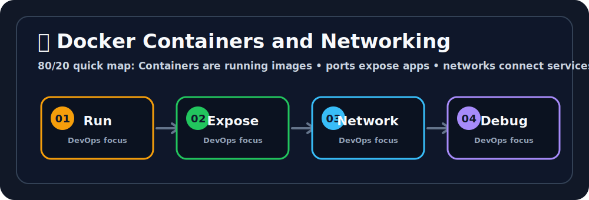

# 🚢 Docker Containers and Networking

## 🖼️ Quick Visual Summary



> **80/20 Summary:** containers are running images, ports expose apps, networks connect containers, and logs tell you what happened. 🌐

## 1. Big Picture

Ravi, this is where Docker becomes useful for real apps.

An image is just a template.
A container is the living instance.
Networking lets containers talk to the outside world and to each other.

## 2. Real-Life Analogy

Ravi, think of a container like an apartment unit in a building 🏢

- the building is the Docker host
- each unit is a container
- the mail slot is the port
- the hallway network connects the units

## 3. Technical Definition

A Docker container is an isolated running instance of an image, and Docker networking provides communication paths between containers, hosts, and external systems.

## 4. Internal Working

```text
docker run
   |
   v
Container starts
   |
   v
Network namespace created
   |
   v
Port mapping applied
   |
   v
Traffic reaches container
```

## 5. Key Concepts

| Concept | Meaning |
| --- | --- |
| Container | Running app instance 🚀 |
| Port mapping | Host port to container port bridge 🔁 |
| Bridge network | Default Docker network 🌉 |
| User-defined bridge | Custom network with DNS support 🧩 |
| Network namespace | Isolated network stack 🌐 |
| `-p` | Publish a port to the host 🚪 |

## 6. Commands

| Command | Why we use it | What happens internally |
| --- | --- | --- |
| `docker run -d -p 8080:80 nginx` | Run and expose a container | Starts a container and maps ports |
| `docker ps` | See running containers | Lists active containers |
| `docker exec -it <id> /bin/bash` | Debug inside a container | Opens a shell inside the running container |
| `docker logs -f <id>` | Read live logs | Streams stdout and stderr |
| `docker stop <id>` | Stop container gently | Sends a stop signal |

## 7. Real Production Usage

Ravi, this is how Docker networking shows up in real projects:

- web apps exposed on a port
- backend containers talking on a shared network
- local stacks with multiple services
- debugging why one container cannot reach another

## 8. Common Mistakes

- ❌ Forgetting port mapping
  - Why it is wrong: the app may run, but no one can reach it.
  - ✅ Correct: publish the port with `-p`.

- ❌ Using random container IPs
  - Why it is wrong: container IPs can change.
  - ✅ Correct: use Docker networks and names.

- ❌ Ignoring logs
  - Why it is wrong: logs usually show the real failure.
  - ✅ Correct: read logs before guessing.

## 9. Best Practices

1. Use user-defined bridge networks.
2. Publish only the ports you need.
3. Use container names for communication.
4. Check logs early.
5. Keep containers focused on one job.

## 10. Interview Corner

Ravi, your interviewer might ask this. 🎤

**Q1: What is a Docker container?**
A1: A running instance of an image.

**Q2: What does `-p 8080:80` do?**
A2: It maps host port 8080 to container port 80.

**Q3: What is a bridge network?**
A3: A Docker network that connects containers together.

**Q4: Why use user-defined networks?**
A4: They provide name-based container communication.

**Q5: Why are logs important?**
A5: They help explain what the container was doing.

## 11. Revision Summary

- Container = running image 🚀
- `-p` = port mapping 🔁
- Bridge network = default connection 🌉
- Logs = debugging clues 🪵

## 12. Key Takeaways

- Containers need networking to be useful.
- Port mapping exposes services.
- Networks help containers find each other.
- Logs are your best debugging friend.

## 13. Comparison Table

| Host Port | Container Port |
| --- | --- |
| Lives on the machine | Lives inside the container |
| Entry from outside | App listener inside container |

## 14. Memory Tricks

- **Host port = street address**
- **Container port = apartment number**
- **Logs = diary**

## 15. Official Docs

- [Docker Networking](https://docs.docker.com/network/)
- [Docker Container Logs](https://docs.docker.com/engine/reference/commandline/logs/)
