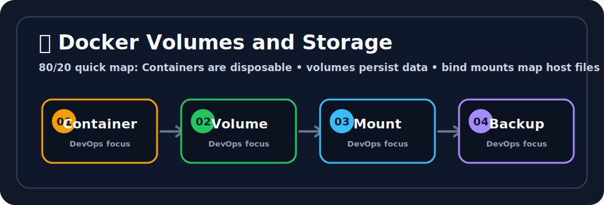

# 💾 Docker Volumes and Storage

## 🖼️ Quick Visual Summary



> **80/20 Summary:** containers are disposable, volumes persist data, bind mounts sync files, and tmpfs keeps data in memory. 💡

## 1. Big Picture

Ravi, this is the storage lesson that protects real data.

Containers are meant to be temporary.
That is good for app code, but bad for databases, uploads, and important files.

Volumes solve that problem by keeping data outside the container lifecycle.

## 2. Real-Life Analogy

Ravi, think of a container like a hotel room and a volume like a storage locker 🧳

- the room can change
- the locker stays yours
- your important stuff stays safe even if the room disappears

## 3. Technical Definition

Docker storage options let containers keep data using managed volumes, bind mounts, or temporary memory-backed storage.

## 4. Internal Working

```text
Container writes data
   |
   v
Volume or mount receives data
   |
   v
Data survives container replacement
```

## 5. Key Concepts

| Concept | Meaning |
| --- | --- |
| Volume | Docker-managed persistent storage 💾 |
| Bind mount | Host path mapped into the container 🔗 |
| tmpfs | RAM-backed temporary storage ⚡ |
| Ephemeral | Short-lived and disposable 🫧 |
| Persistence | Data survives container restarts 🛡️ |

## 6. Commands

| Command | Why we use it | What happens internally |
| --- | --- | --- |
| `docker volume create my-postgres-data` | Create persistent storage | Docker allocates a managed volume |
| `docker volume ls` | See volumes | Lists all stored volumes |
| `docker run -d -v my-postgres-data:/var/lib/postgresql/data postgres:14` | Attach a volume | Mounts volume into container path |
| `docker run -d -v /host/path:/app nginx` | Use bind mount | Maps a host folder into the container |
| `docker volume prune` | Clean unused volumes | Removes dangling volumes |

## 7. Real Production Usage

Ravi, volumes are everywhere in real systems:

- databases need persistence
- logs may need to be stored
- config files may be mounted
- local development often uses bind mounts

## 8. Common Mistakes

- ❌ Storing database data only inside the container
  - Why it is wrong: the data disappears when the container is removed.
  - ✅ Correct: use a volume.

- ❌ Using bind mounts carelessly
  - Why it is wrong: bad host paths can break the container.
  - ✅ Correct: verify the path before mounting.

- ❌ Deleting volumes without checking
  - Why it is wrong: you can lose persistent data.
  - ✅ Correct: confirm what you are deleting.

## 9. Best Practices

1. Use volumes for persistent app data.
2. Use bind mounts for local development.
3. Back up important data.
4. Keep storage paths predictable.
5. Avoid storing critical data only in containers.

## 10. Interview Corner

Ravi, your interviewer might ask this. 🎤

**Q1: Why are containers ephemeral?**
A1: Because they are meant to be disposable.

**Q2: What is a Docker volume?**
A2: Persistent storage managed by Docker.

**Q3: What is a bind mount?**
A3: A direct host path mounted into the container.

**Q4: Why use volumes for databases?**
A4: So the data survives container replacement.

**Q5: What is tmpfs?**
A5: Temporary storage in memory.

## 11. Revision Summary

- Containers are disposable 🫧
- Volumes persist data 💾
- Bind mounts connect host and container 🔗
- tmpfs uses RAM ⚡

## 12. Key Takeaways

- Storage is separate from container life.
- Volumes are the safest general choice.
- Bind mounts are great for development.
- Never trust container-only data for important state.

## 13. Comparison Table

| Volume | Bind Mount | tmpfs |
| --- | --- | --- |
| Docker-managed | Host path mapped | Memory-backed |
| Best for persistence | Best for local dev | Best for temporary fast data |

## 14. Memory Tricks

- **Volume = locker**
- **Bind mount = window**
- **tmpfs = RAM drawer**

## 15. Official Docs

- [Docker Volumes](https://docs.docker.com/storage/volumes/)
- [Docker Bind Mounts](https://docs.docker.com/storage/bind-mounts/)
