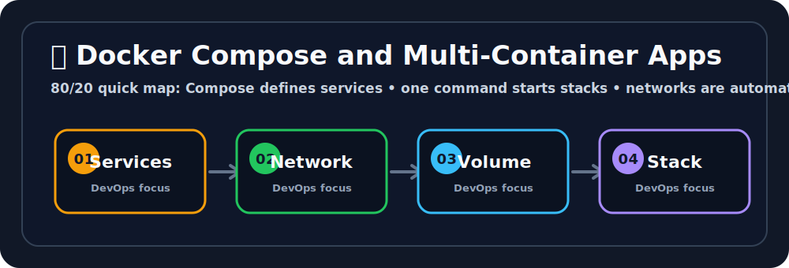

# 🧩 Docker Compose

## 🖼️ Quick Visual Summary



> **80/20 Summary:** Compose defines multi-container apps, starts them together, connects networks automatically, and keeps storage manageable. 🚀

## 1. Big Picture

Ravi, this is how you run a small app stack without typing five long `docker run` commands.

Real applications usually need more than one container.
Docker Compose lets you describe the whole stack in a simple YAML file and start it with one command.

## 2. Real-Life Analogy

Ravi, think of Compose like a restaurant kitchen team 👩‍🍳

- one person handles prep
- one handles cooking
- one handles serving
- they all follow the same plan

Compose does that for containers.

## 3. Technical Definition

Docker Compose is a tool for defining and running multi-container Docker applications using a declarative YAML file.

## 4. Internal Working

```text
docker-compose.yml
   |
   | docker-compose up
   v
Network created
   |
   v
Services started
   |
   v
Volumes attached
   |
   v
App stack runs together
```

## 5. Key Concepts

| Concept | Meaning |
| --- | --- |
| Service | One containerized app component 🧩 |
| `docker-compose.yml` | The app stack definition 📄 |
| `depends_on` | Startup order hint ⏩ |
| Network | Automatic communication layer 🌐 |
| Volume | Persistent storage for services 💾 |

## 6. Commands

| Command | Why we use it | What happens internally |
| --- | --- | --- |
| `docker-compose up -d` | Start the whole stack | Creates network and starts services |
| `docker-compose logs -f` | Follow logs | Streams combined container logs |
| `docker-compose down` | Stop the stack | Removes containers and network |
| `docker-compose down -v` | Stop and remove volumes | Removes containers, network, and volumes |
| `docker-compose up -d --build` | Rebuild and run | Rebuilds images before starting |

## 7. Real Production Usage

Ravi, Compose is often used for:

- local development stacks
- quick demos
- CI test environments
- small service bundles

## 8. Common Mistakes

- ❌ Writing a huge `docker run` command for every service
  - Why it is wrong: it is hard to read and easy to break.
  - ✅ Correct: use Compose.

- ❌ Forgetting service dependencies
  - Why it is wrong: one container may start before the other is ready.
  - ✅ Correct: declare the relationship clearly.

- ❌ Removing volumes by accident
  - Why it is wrong: you can lose persistent data.
  - ✅ Correct: know when to use `down -v`.

## 9. Best Practices

1. Keep Compose files readable.
2. Use named volumes for data.
3. Separate app and database services.
4. Use environment variables for config.
5. Rebuild when dependencies change.

## 10. Interview Corner

Ravi, your interviewer might ask this. 🎤

**Q1: What is Docker Compose?**
A1: A tool for defining and running multi-container apps.

**Q2: Why use Compose?**
A2: It makes multi-service setups easier to manage.

**Q3: What does `up -d` do?**
A3: Starts the stack in detached mode.

**Q4: What does `down -v` do?**
A4: Stops the stack and removes volumes too.

**Q5: When is Compose useful?**
A5: For local development, testing, and small app stacks.

## 11. Revision Summary

- Compose = multi-container manager 🧩
- YAML = stack definition 📄
- `up -d` = start stack 🚀
- `down` = stop stack 🛑
- Networks and volumes are automatic 🌐💾

## 12. Key Takeaways

- Compose keeps multi-container apps simple.
- It is perfect for local stacks.
- Networks and volumes are handled for you.
- It saves time and reduces mistakes.

## 13. Comparison Table

| Docker run | Docker Compose |
| --- | --- |
| One container at a time | Multiple services together |
| Many long commands | One YAML file |
| Harder to maintain | Easier to share |

## 14. Memory Tricks

- **Compose = orchestra conductor**
- **Service = instrument**
- **YAML = sheet music**

## 15. Official Docs

- [Docker Compose](https://docs.docker.com/compose/)
- [Compose File Reference](https://docs.docker.com/compose/compose-file/)
