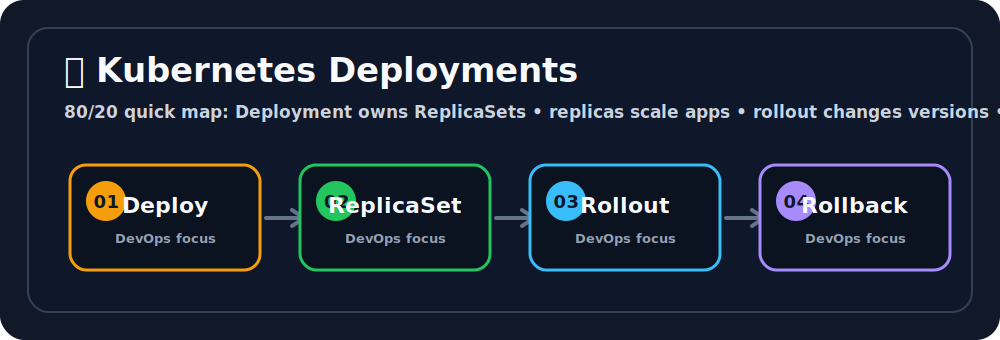

# 🚀 Kubernetes Deployments


## 🖼️ Quick Visual Summary



> **⚡ 80/20 Summary:** Deployment owns ReplicaSets • replicas scale apps • rollout changes versions • rollback restores safety

## 1. 🎯 Overview
In Kubernetes, you should **never** deploy raw Pods or manual ReplicaSets directly to a production cluster. Instead, you use a **Deployment**. A Deployment is a higher-level abstraction that sits on top of a ReplicaSet. Its primary superpower is managing the lifecycle of applications, allowing for seamless rolling updates, instant rollbacks, and version history targeting.

## 2. 💡 Why This Matters
- **Zero-Downtime Releases:** If you need to upgrade an application from v1 to v2, a Deployment orchestrates a graceful transition where v2 pods are slowly brought up while v1 pods are slowly drained, ensuring customers never see a 404 error perfectly.
- **Safety Nets (Rollbacks):** If a new release completely fails mid-deployment, you can issue one command to hit the "Undo" button, and Kubernetes will instantly revert to the previous reliable ReplicaSet perfectly.
- **Declarative Updates:** You tell the Deployment "Change the image to v2", and K8s calculates all the underlying complexity (creating a new ReplicaSet, pacing the rollout, cleaning up the old ReplicaSet).

## 3. 🧠 Core Concepts
- **Deployment Controller:** The brain managing the rollout strategy. It owns and manipulates ReplicaSets.
- **ReplicaSet Versioning:** Every time you alter the Pod Template inside a Deployment YAML (e.g., change the image tag or environment variables), the Deployment creates an entirely new ReplicaSet to represent that new version.
- **Rollout History:** K8s keeps the old ReplicaSets completely intact but scaled down to `0`. This is the exact mechanism that enables instant rollbacks.
- **Strategies:** You can choose between `RollingUpdate` (gradual replacement - default) or `Recreate` (kill all old Pods immediately, then boot the new ones - causes downtime, used mostly for legacy monolithic databases).

## 4. 🧭 Architecture / Workflow
1. **Initial Creation:** You apply a Deployment config requesting 3 Nginx v1 pods. The Deployment creates `ReplicaSet-A` and scales it to 3.
2. **Update Triggered:** A DevOps engineer edits the Deployment image to Nginx v2.
3. **New Version Generation:** The Deployment controller creates a new, completely empty `ReplicaSet-B`.
4. **The See-Saw:** The Deployment carefully scales `ReplicaSet-B` up to 1, while scaling `ReplicaSet-A` down to 2. It repeats this mathematical dance until `ReplicaSet-B` is at 3, and `ReplicaSet-A` is at 0.

## 5. 🛠️ Commands & Practical Usage

Create a robust deployment imperatively from the CLI:
```bash
kubectl create deployment my-api --image=node:18 --replicas=3
```

Check the physical status of the Deployment:
```bash
kubectl get deployments
```

Update a Deployment's image without touching YAML files (Trigger a rollout):
```bash
kubectl set image deployment/my-api node=node:20.0
```

Watch the rolling update progress happen in real-time perfectly:
```bash
kubectl rollout status deployment/my-api
```

View the historical timeline of version updates:
```bash
kubectl rollout history deployment/my-api
```

Instantly undo a terrible upgrade:
```bash
kubectl rollout undo deployment/my-api
```

## 6. ⚙️ Configuration / YAML / Code Examples

A standard architectural format for a stateless Web Application Deployment, demonstrating labels and resource constraints:

```yaml
apiVersion: apps/v1
kind: Deployment
metadata:
  name: backend-auth-deployment
  labels:
    component: auth-service
spec:
  replicas: 4
  revisionHistoryLimit: 5 # Only keep the last 5 old ReplicaSets to save system RAM
  selector:
    matchLabels:
      app: backend-auth
  strategy:
    type: RollingUpdate # As opposed to "Recreate"
  template:
    metadata:
      labels:
        app: backend-auth  # Critical: MUST perfectly match the selector above!
    spec:
      containers:
      - name: auth-api
        image: company/auth-api:v2.1.0
        ports:
        - containerPort: 8080
        resources:                   # Guardrails against infinite memory leaks
          requests:
            memory: "128Mi"
            cpu: "250m"
          limits:
            memory: "256Mi"
            cpu: "500m"
```

## 7. 🧪 Hands-on Step-by-Step

**Step 1: Save and Apply the YAML**
Save the code snippet from Section 6 into `auth-deployment.yaml`.
```bash
kubectl apply -f auth-deployment.yaml
```

**Step 2: Trace the Genealogy structure**
Understand how the abstractions stack. 
Look at the Deployment: `kubectl get deploy`
Look at the ReplicaSet it spawned: `kubectl get rs`
Look at the Pods the RS spawned: `kubectl get pods`

**Step 3: Trigger a declarative modification**
Open `auth-deployment.yaml`, change `replicas: 4` to `replicas: 6`, and re-apply:
```bash
kubectl apply -f auth-deployment.yaml
# K8s will see the desired state changed, and scale up.
```

**Step 4: Execute a surgical rollback**
Change the YAML image to complete nonsense: `image: company/auth-api:DUMMY_TAG`, and apply.
Check the rollout status; it will fail and permanently hang: `kubectl rollout status deploy/backend-auth-deployment`.
Fix it elegantly by rewinding time:
```bash
kubectl rollout undo deployment/backend-auth-deployment
```

## 8. 🚨 Common Errors & Troubleshooting

- **Error: Updating the Deployment does not trigger a rollout or recreate pods.**
  - **Issue:** The Deployment only triggers a rollout if the *Pod Template* (`spec.template`) is materially altered (like changing the Image, Environment variables, or Resource limits). Changing the overall Replica count or Deployment labels does NOT trigger K8s to reboot the pods.
  - **Fix:** If you need to forcefully restart pods to pick up a secret modification, run `kubectl rollout restart deployment <name>`.
- **Error: `Deployment does not have minimum availability.`**
  - **Issue:** During an update, none of the newly spawned v2 Pods are passing their Readiness probes, so K8s legally refuses to shut down the old v1 pods, leaving the deployment mathematically stuck.
  - **Fix:** Debug the new pods by reading their logs. Check why the application is failing to start. (e.g. `kubectl describe pod <failing-new-pod>`).

## 9. ✅ Best Practices

1. **Explicit Resource Limits:** Always, unconditionally set `requests` and `limits` for CPU and Memory in your Deployment. If you do not, a memory leak in a single Node.js Pod will consume the entire Worker Node's RAM, violently crashing all other applications on that server.
2. **Never deploy blindly:** Always use Readiness Probes. Without them, the Deployment Controller blindly assumes your pod is 100% operational the exact second the container binary boots, and will ruthlessly terminate your old healthy pods.
3. **Use Revision Flags:** When deploying changes from the CLI imperative way, append the `--record` flag so your `kubectl rollout history` actually tells you *what* command triggered that specific revision.

## 10. 🎤 Interview Questions & Answers

**Q1: Explain the hierarchy between Deployments, ReplicaSets, and Pods.**
**A1:** A Deployment is the top-level parent manager. It manages multiple ReplicaSets (for version control). A ReplicaSet manages multiple Pods (for horizontal scaling). The Pod manages the actual Containers. K8s engineers generally interact strictly with Deployments.

**Q2: In what scenario would you explicitly choose the `Recreate` strategy over `RollingUpdate`?**
**A2:** If an application relies on a Legacy SQL database schema migration where running v1 code and v2 code simultaneously would violently corrupt the data. `Recreate` ensures v1 is 100% shut down completely before v2 boots up.

**Q3: How does a Deployment handle a scenario where a newly deployed image puts the pod into an `ErrImagePull` state?**
**A3:** It executes mathematical protection. K8s calculates the `maxUnavailable` parameters. Since the new pods cannot start, the update halts completely. The old ReplicaSet will fundamentally remain scaled up, ensuring zero customer downtime. 

**Q4: If I adjust a ConfigMap or Secret, will the Deployment automatically restart the pods to inject the new values?**
**A4:** No. By default, K8s Deployments do not actively watch external ConfigMaps for modifications. You must explicitly trigger a manual restart via `kubectl rollout restart deployment <name>`, or use external open-source tools like Reloader.

**Q5: What is the `revisionHistoryLimit` fundamentally used for?**
**A5:** Over years of operations, a CI/CD pipeline might deploy 5,000 updates. This would leave 5,000 dead ReplicaSets sitting dormant in the K8s `etcd` database, bloating the system memory. `revisionHistoryLimit` ensures K8s deletes archaic histories, keeping only the most recent N updates available for fallback.

## 11. ⚡ Quick Revision Summary
- **Deployment:** The production-grade standard wrapper for stateless apps.
- **Superpowers:** Rolling Updates, Rollbacks, Strategy Tuning, Pause/Resume.
- **Rollback:** `kubectl rollout undo` is your get-out-of-jail-free card.
- **Mechanism:** Leverages an army of ReplicaSets scaled sequentially to guarantee zero downtime.

## 12. 🔗 Official Documentation Links
- [Kubernetes Deployments Deep Dive](https://kubernetes.io/docs/concepts/workloads/controllers/deployment/)
- [Managing Resources for Docker Containers](https://kubernetes.io/docs/concepts/configuration/manage-resources-containers/)
