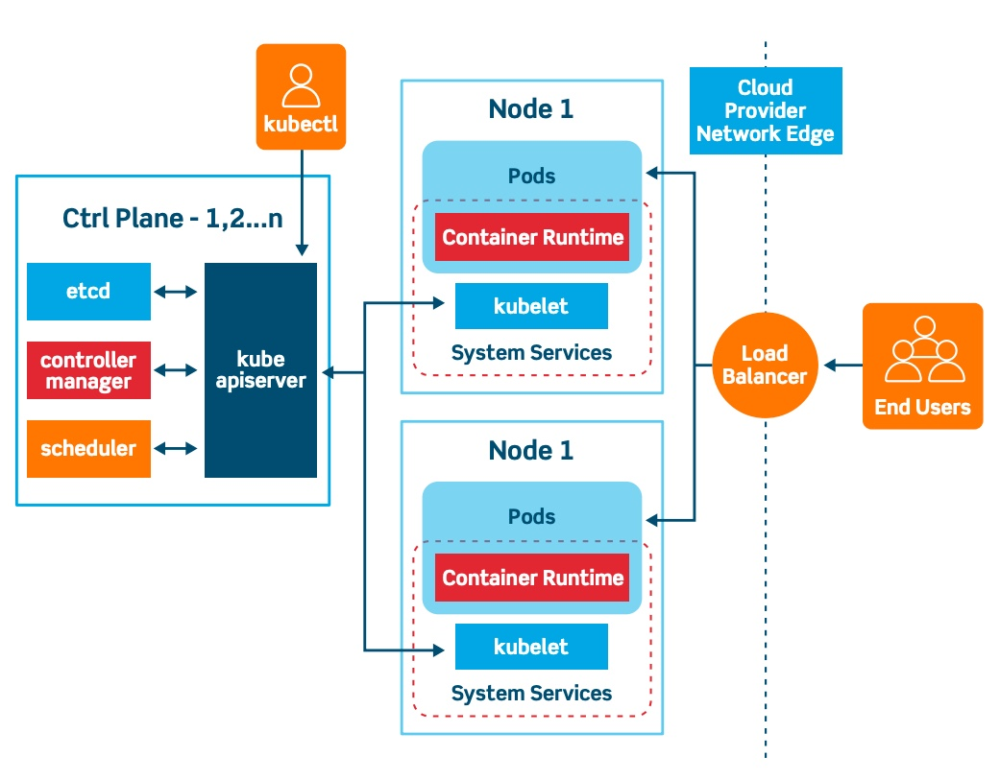

# ☸️ Kubernetes Architecture

## 🖼️ Quick Visual Summary


> **⚡ 80/20 Summary:** API server receives intent • etcd stores state • scheduler places pods • kubelet runs workloads



## 1. 🎯 Overview

Kubernetes (often abbreviated as **K8s**) is an open-source container orchestration platform. If Docker is the engine that runs a single container, Kubernetes is the conductor that manages thousands of containers across hundreds of servers. It handles scheduling, self-healing, scaling, and load balancing automatically.

## 2. 💡 Why This Matters

- **High Availability:** If a server (Node) crashes and burns, Kubernetes instantly detects it and reschedules the containers (Pods) on a healthy server.
- **Infinite Scalability:** Traffic spikes on Black Friday? K8s automatically spins up 50 more frontend containers, and then scales them back down when traffic subsides to save money.
- **Declarative Management:** You don't write scripts telling K8s _how_ to do things. You write a YAML file describing the _desired state_ ("I want 3 Nginx pods"). K8s figures out how to make reality match your YAML.

## 3. 🧠 Core Concepts

The architecture is split into two halves: The **Control Plane** (The Brain) and the **Worker Nodes** (The Muscle).

**Control Plane Components:**

- **API Server (`kube-apiserver`):** The front door of K8s. Every command you run (`kubectl`) talks directly to the API Server.
- **Etcd:** A highly available key-value database that stores the absolute "truth" and state of the entire cluster.
- **Scheduler (`kube-scheduler`):** When you ask for a new Pod, the Scheduler looks at CPU/RAM availability across all worker nodes and decides which server should host the Pod.
- **Controller Manager:** The tireless watcher. It constantly compares the _current state_ of the cluster to your _desired state_ and fixes any discrepancies.

**Worker Node Components:**

- **Kubelet:** The agent running on every node. It takes orders from the API server and reports back the health of its node.
- **Kube-proxy:** Handles network routing rules, ensuring that requests to a Service are magically routed to the correct backend Pod.
- **Container Runtime:** The software actually running the containers (e.g., `containerd`, `CRI-O`, or Docker).

## 4. 🧭 Architecture / Workflow

1. **User Request:** You type `kubectl apply -f my-app.yaml`.
2. **API Reception:** The `kube-apiserver` validates the YAML and saves the desired state into `etcd`.
3. **Scheduling:** The `kube-scheduler` sees a new Pod needs to be created. It selects `Worker-Node-2` because it has the most free RAM.
4. **Execution:** The `kube-apiserver` tells the Kubelet on `Worker-Node-2` to start the Pod.
5. **Boot:** The Kubelet commands the Container Runtime to pull the image and start the container.
6. **Continuous Loop:** If `Worker-Node-2` catches fire 10 minutes later, the Controller Manager notices it stopped reporting, marks it dead, and asks the Scheduler to place the Pod on `Worker-Node-1`.

## 5. 🛠️ Commands & Practical Usage

Check the health of your clustered servers (Nodes):

```bash
kubectl get nodes
```

See absolutely everything running across all namespaces:

```bash
kubectl get all -A
```

Get detailed diagnostic information about the cluster:

```bash
kubectl cluster-info
```

Watch K8s components continuously (Real-time monitoring):

```bash
kubectl get events --sort-by='.metadata.creationTimestamp' -w
```

## 6. ⚙️ Configuration / Code Examples

While you don't usually "configure" the architecture manually in managed cloud environments (like EKS or GKE), here is an example of what the `kubelet` configuration might look like under the hood on a worker node:

```yaml
apiVersion: kubelet.config.k8s.io/v1beta1
kind: KubeletConfiguration
address: "0.0.0.0"
port: 10250
cgroupDriver: systemd # Tells kubelet to use systemd for resource management
clusterDNS:
  - "10.96.0.10" # The IP of CoreDNS so containers can resolve names
clusterDomain: "cluster.local"
failSwapOn: true # Standard K8s rule: Worker nodes MUST have swap disabled
```

## 7. 🧪 Hands-on Step-by-Step

_To practice this locally without needing 5 physical servers, use `Minikube`, which installs a single-node Kubernetes cluster inside a Docker container on your laptop._

**Step 1: Start a local cluster**

```bash
minikube start --driver=docker
```

**Step 2: Verify the Control Plane is responding**

```bash
kubectl cluster-info
```

**Step 3: Look at the core components running secretly in the `kube-system` namespace**

```bash
kubectl get pods -n kube-system
```

> _Observe the `etcd`, `kube-apiserver`, `kube-controller-manager`, and `kube-proxy` pods._

**Step 4: Check node capacity**

```bash
kubectl describe node | grep -i capacity -A 5
```

**Step 5: Stop the cluster**

```bash
minikube stop
```

## 8. 🚨 Common Errors & Troubleshooting

- **Error: `The connection to the server localhost:8080 was refused`**
  - **Issue:** Your `kubectl` command cannot find the Control Plane API Server.
  - **Fix:** Ensure your cluster is actually running. Verify your `~/.kube/config` file points to the correct cluster address.
- **Error: Worker node transitions to `NotReady` status**
  - **Issue:** The `kubelet` process on that node crashed, the node ran completely out of disk space, or network connectivity between the Worker and Control Plane was severed.
  - **Fix:** SSH into the worker node, run `systemctl status kubelet`, and check `journalctl -u kubelet` for the exact crash reason.
- **Error: `kubectl` commands are timing out or slow.**
  - **Issue:** The `etcd` database is overwhelmed or disk I/O on the Control Plane node is too slow. K8s requires an extremely fast SSD for etcd to function properly.

## 9. ✅ Best Practices

1. **Use Managed Services:** Unless you have a team of 10 infrastructure engineers, do NOT build Kubernetes architecture from scratch (known as "Kubernetes the Hard Way"). Use AWS EKS, GCP GKE, or Azure AKS. Let the cloud provider manage the Control Plane.
2. **Never SSH into Worker Nodes manually:** Worker nodes should be treated as disposable cattle. If a node is behaving weirdly, delete it. The Autoscaler will automatically boot a fresh, healthy node to replace it.
3. **RBAC (Role-Based Access Control):** Lock down the API server. Developers should not have admin rights to the production cluster. Bind their authentication to an Active Directory group.

## 10. 🎤 Interview Questions & Answers

**Q1: What happens if the `etcd` database is destroyed and there are no backups?**
**A1:** The entire cluster is permanently lost. All state, configurations, secrets, and deployments are gone. The worker nodes will keep running existing applications, but you will completely lose the ability to manage, update, or recover them.

**Q2: What is the difference between `kube-proxy` and the `kubelet`?**
**A2:** The `kubelet` is the captain of the node; it takes orders from the API server and physically boot containers. `kube-proxy` strictly handles network routing and firewall rules (iptables/IPVS) natively on that node.

**Q3: Can a worker node make decisions on where to schedule a Pod?**
**A3:** Absolutely not. The `kube-scheduler`, which strictly lives on the Control Plane, is the only component legally allowed to decide where a Pod is placed based on cluster-wide metrics.

**Q4: Why does Kubernetes require Swap memory to be disabled on all worker nodes by default?**
**A4:** Because K8s scheduler heavily relies on explicit calculation of RAM limits. If a node begins offloading RAM to a slow hard drive Swap partition, performance becomes wildly unpredictable, and the Kubelet loses track of true memory consumption.

**Q5: If the Control Plane goes down entirely, do the applications running on the Worker Nodes crash?**
**A5:** No. The Kubelet and Container Runtime on the worker nodes will happily keep running their current workloads. However, you cannot deploy new apps, self-healing routing breaks, and auto-scaling completely stops.

## 11. ⚡ Quick Revision Summary

- **Control Plane:** The Brain. API Server, Etcd (Database), Scheduler, Controller Manager.
- **Worker Node:** The Muscle. Kubelet, Kube-proxy, Container Runtime.
- **Declarative:** You define the _what_, Kubernetes calculates the _how_.
- **Etcd is God:** If it dies, the cluster dies. Back it up.

## 12. 🔗 Official Documentation Links

- [Kubernetes Architecture Concept](https://kubernetes.io/docs/concepts/architecture/)
- [Kubernetes Components](https://kubernetes.io/docs/concepts/overview/components/)
