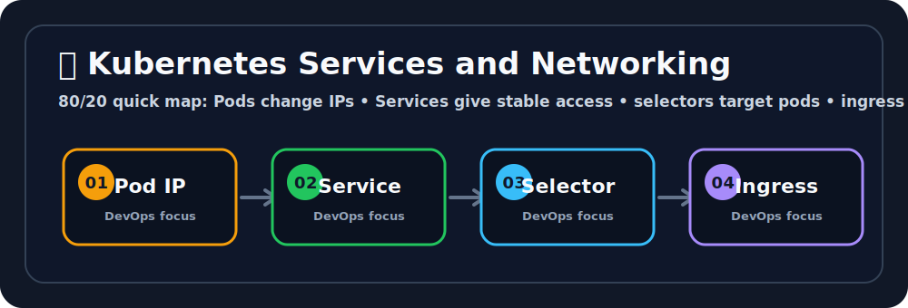

# 🌐 Services and Networking

## 🖼️ Quick Visual Summary



> **80/20 Summary:** Pods are temporary, Services are stable, and kube-proxy sends traffic to the right Pod. 🌐

## 1. Big Picture

Ravi, focus on this because it is how apps talk to each other in Kubernetes. 💬

Pods are not reliable network targets because their IPs can change at any time.
That is why Kubernetes uses **Services**.

A Service gives your app a stable name and stable IP, even when the Pods behind it change.

## 2. Real-Life Analogy

Ravi, think of a hotel front desk that never changes even when the rooms do. 🛎️

Think of a Service like a hotel front desk 🛎️

- guests ask for the hotel name, not a room number
- the front desk knows which rooms are active
- if a room closes, the desk sends new guests somewhere else

The front desk stays stable while the rooms change.

## 3. Technical Definition

Ravi, this is the definition that makes Services click.

A Service is a Kubernetes abstraction that defines a stable network endpoint for a dynamic set of Pods.

## 4. Internal Working

Ravi, this is the path traffic follows from name to Pod.

```text
Client
  |
  | service name / DNS
  v
CoreDNS
  |
  | service IP
  v
kube-proxy
  |
  | routes to matching endpoints
  v
Pod IPs
```

### Service Types

Ravi, these are the three Service types to remember.

| Type | What it is for |
| --- | --- |
| `ClusterIP` | Internal traffic inside the cluster 🔒 |
| `NodePort` | Exposes the Service on each worker node 🚪 |
| `LoadBalancer` | Requests a cloud load balancer from the provider ☁️ |

## 5. Key Concepts

| Concept | Meaning |
| --- | --- |
| Service | Stable access point for Pods 🌟 |
| Selector | Matches Pods using labels 🏷️ |
| Endpoint | Actual Pod IPs behind the Service 📍 |
| CoreDNS | Resolves Service names to Service IPs 🧭 |
| kube-proxy | Applies routing rules on nodes 🔀 |
| `targetPort` | Port inside the Pod that receives traffic 🎯 |
| `port` | Port exposed by the Service itself 🔌 |

## 6. Commands

Ravi, these commands help you see where traffic is flowing.

| Command | Why we use it | What happens internally |
| --- | --- | --- |
| `kubectl get svc` | See Services and IPs | Reads Service objects from the cluster |
| `kubectl describe svc <name>` | Debug Service config | Shows selector, ports, and endpoints |
| `kubectl get endpoints <name>` | Check backend Pods | Lists the Pod IPs matched by the selector |
| `kubectl expose deployment <name> ...` | Create a Service quickly | Generates a Service for an existing workload |

## 7. Real Production Usage

Services are used for:

- internal APIs 🔌
- database access inside the cluster 🗄️
- stable access to microservices 🧩
- cloud load balancing for public apps ☁️

Most teams use `ClusterIP` for internal services and place an Ingress in front of public HTTP apps.

## 8. Common Mistakes

Ravi, these are the networking mistakes that show up all the time.

- ❌ Using Pod IPs directly
  - Why it is wrong: Pod IPs change when Pods are replaced.
  - ✅ Correct: use a Service name.

- ❌ Mismatched selector labels
  - Why it is wrong: the Service has no backend Pods.
  - ✅ Correct: match Service selectors with Pod labels.

- ❌ Exposing databases with `LoadBalancer`
  - Why it is wrong: it makes private data too easy to reach.
  - ✅ Correct: keep databases internal with `ClusterIP`.

- ❌ Confusing `port` and `targetPort`
  - Why it is wrong: traffic arrives at the wrong place.
  - ✅ Correct: `port` is the Service port, `targetPort` is the app port.

## 9. Best Practices

Ravi, this is the safe networking checklist.

1. Use Service names for communication, not Pod IPs.
2. Keep databases private.
3. Use `ClusterIP` by default.
4. Validate selectors with `kubectl get endpoints`.
5. Use Ingress for HTTP apps with many routes.

## 10. Interview Corner

Ravi, your interviewer might ask this. 🎤

**Q1: Why do we need Services?**
A1: Because Pod IPs are temporary and Services are stable.

**Q2: What does `ClusterIP` do?**
A2: It exposes the Service only inside the cluster.

**Q3: What is the difference between `port` and `targetPort`?**
A3: `port` is the Service port; `targetPort` is the Pod port.

**Q4: Why use `kubectl get endpoints`?**
A4: To verify which Pods are actually behind the Service.

**Q5: What is `kube-proxy` doing?**
A5: It programs node-level routing so traffic reaches the right Pod.

## 11. Revision Summary

Ravi, this is the quick networking recap.

- Pods are temporary 🌀
- Services are stable 🚪
- DNS points to the Service 🧭
- kube-proxy routes to Pods 🔀
- Labels make the connection work 🏷️

## 12. Key Takeaways

- Services solve unstable Pod networking.
- Selectors and labels must match.
- `ClusterIP` is the default.
- `LoadBalancer` is for public entry points.

## 13. Comparison Table

| ClusterIP | NodePort | LoadBalancer |
| --- | --- | --- |
| Internal only | Exposed on node ports | Exposed through cloud load balancer |
| Best for internal microservices | Useful for testing or simple exposure | Best for production public access |
| Most common type | Less common | Common in cloud environments |

## 14. Memory Tricks

Ravi, keep these labels and front-door ideas in your head.

- **Service = stable front door**
- **Pod = moving room**
- **Selector = who belongs here**
- **Endpoint = actual room list**

## 15. Official Docs

- [Service](https://kubernetes.io/docs/concepts/services-networking/service/)
- [Debugging Services](https://kubernetes.io/docs/tasks/debug/debug-application/debug-service/)
