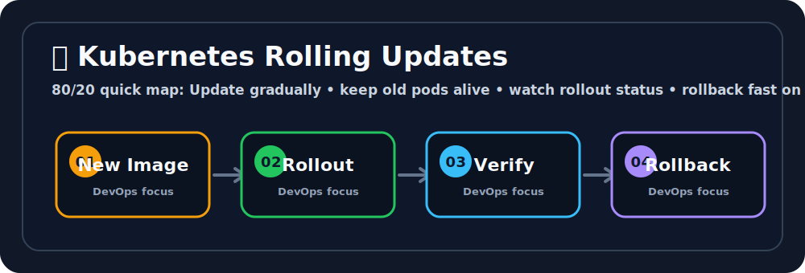

# 🔁 Kubernetes Rolling Updates

## 🖼️ Quick Visual Summary



> **80/20 Summary:** change gradually, keep old Pods alive, and keep rollback ready. ⏪

## 1. Big Picture

Ravi, this is how you ship new versions safely.

A rolling update lets Kubernetes replace old Pods with new Pods little by little.
That means users keep getting service while the release happens.

## 2. Real-Life Analogy

Think of changing theater seats while the movie is still playing 🎬

- you do not stop the movie for everyone
- you replace seats one row at a time
- if the new row has a problem, the old row stays usable

That is the safety idea behind rolling updates.

## 3. Technical Definition

A rolling update is a Deployment strategy that gradually replaces old Pods with new Pods while keeping the application available.

## 4. Internal Working

```text
Old ReplicaSet      New ReplicaSet
     |                    |
     |  scale up           |
     |-------------------->|
     |                     |
     |  scale down         |
     |<--------------------|
     |
Readiness probe must pass before traffic shifts
```

### Important Settings

| Setting | Meaning |
| --- | --- |
| `maxSurge` | Extra Pods allowed during the rollout ➕ |
| `maxUnavailable` | Pods that can be offline during the rollout ➖ |
| Readiness probe | Confirms the Pod is ready for live traffic ✅ |

## 5. Key Concepts

| Concept | Meaning |
| --- | --- |
| Rollout | The process of moving to a new version 🚦 |
| Rollback | Returning to a previous version ⏪ |
| Revision | A saved version of the Deployment 🧾 |
| Ready Pod | A Pod that can safely receive traffic ✅ |
| Old ReplicaSet | The previous version still kept around for safety 🧱 |

## 6. Commands

| Command | Why we use it | What happens internally |
| --- | --- | --- |
| `kubectl set image deployment/<name> ...` | Trigger a new version | Changes the Pod template |
| `kubectl rollout status deployment/<name>` | Watch progress | Checks rollout conditions |
| `kubectl rollout history deployment/<name>` | See revisions | Reads version history |
| `kubectl rollout undo deployment/<name>` | Revert a bad release | Switches to the previous ReplicaSet |
| `kubectl rollout pause deployment/<name>` | Pause a rollout | Stops further scaling changes |
| `kubectl rollout resume deployment/<name>` | Continue a paused rollout | Restarts rollout progression |

## 7. Real Production Usage

Rolling updates are common when teams ship:

- UI changes
- API changes
- configuration updates
- container image upgrades

They are especially important when a company wants:

- zero-downtime releases
- controlled risk
- easy rollback
- safe automation in CI/CD pipelines

## 8. Common Mistakes

- ❌ Skipping readiness checks
  - Why it is wrong: traffic may reach a Pod that is not ready.
  - ✅ Correct: use readiness probes for rollout safety.

- ❌ Using `latest`
  - Why it is wrong: it makes version tracking unclear.
  - ✅ Correct: use tagged versions or Git SHAs.

- ❌ Updating too much at once
  - Why it is wrong: it increases blast radius.
  - ✅ Correct: release in small steps.

- ❌ Ignoring rollout status
  - Why it is wrong: a broken rollout can go unnoticed.
  - ✅ Correct: monitor the rollout and logs.

## 9. Best Practices

1. Use readiness probes.
2. Use versioned images.
3. Keep `maxUnavailable` low for critical apps.
4. Watch rollout status in CI/CD.
5. Roll back quickly when health checks fail.

## 10. Interview Corner

Ravi, your interviewer might ask this:

**Q1: What is a rolling update?**
A1: A gradual replacement of old Pods with new Pods.

**Q2: Why is it safer than replacing everything at once?**
A2: Because some healthy Pods stay available during the change.

**Q3: What does `maxSurge` do?**
A3: It allows extra Pods to exist during the rollout.

**Q4: What does `maxUnavailable` do?**
A4: It limits how many Pods can be down at once.

**Q5: Why are readiness probes important?**
A5: They decide when a new Pod is safe to receive traffic.

## 11. Revision Summary

- Rolling update = gradual release
- Readiness probe = traffic gate
- `maxSurge` = extra capacity
- `maxUnavailable` = allowed downtime
- `kubectl rollout undo` = fast recovery

## 12. Key Takeaways

- Rolling updates reduce release risk.
- Readiness probes protect users.
- Rollbacks should always be one command away.

## 13. Comparison Table

| RollingUpdate | Recreate |
| --- | --- |
| Keeps old Pods running while new ones start | Stops old Pods first |
| Preferred for most apps | Useful when two versions cannot run together |
| Safer and smoother | Simpler but causes downtime |

## 14. Memory Tricks

- **Surge = extra**
- **Unavailable = downtime allowed**
- **Readiness = traffic green light**

## 15. Official Docs

- [Deployments](https://kubernetes.io/docs/concepts/workloads/controllers/deployment/)
- [Rolling Update Tutorial](https://kubernetes.io/docs/tutorials/kubernetes-basics/update/update-intro/)
