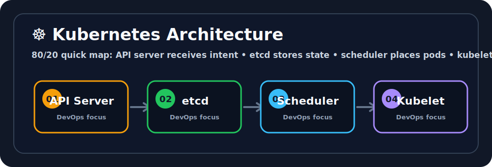

# ☸️ Kubernetes Architecture
## Quick Visual Summary

> **80/20 Summary:** Kubernetes turns many containers on many machines into one system you can control with YAML.

Ravi, think of this as the big-picture map of the cluster. 🌍 The control plane and worker nodes work together like a team so your apps can run smoothly.

## Simple Definition
Kubernetes Architecture explains how to solve one real Kubernetes problem in a practical way.

## Why do we need this?
- Kubernetes feels much easier when you learn one clear problem at a time.
- This topic shows you how to write the YAML and use the commands that matter in real life.

## Best-friend analogy
Ravi, think of Kubernetes like an airport control tower.
- The control plane is the tower.
- The worker nodes are the gates and runways.
- Pods are the planes.
- The scheduler decides the gate.
- Kubelet keeps each gate working smoothly.

## Technical explanation
- Beginner: learn the basic idea and what it solves.
- Intermediate: connect the object to the controller or node that uses it.
- Advanced: understand how Kubernetes keeps desired state and actual state in sync.

## Internal architecture
- Control plane: API server, scheduler, controller manager, and etcd.
- Worker node: kubelet, kube-proxy, and container runtime.
- Desired state lives in YAML and becomes real through controllers.

## Workflow
1. You write YAML.
2. kubectl sends it to the API server.
3. Kubernetes stores and reconciles the desired state.
4. The cluster makes reality match the YAML.

## ASCII diagram
`	ext
kubectl apply
    |
    v
API Server ---> etcd
    |
    v
Scheduler ---> Node
    |
    v
Kubelet ---> Container Runtime ---> Pod
`

## Manifest example
`yaml
apiVersion: v1
kind: Pod
metadata:
  name: architecture-demo
spec:
  containers:
  - name: web
    image: nginx:1.27
`

Line by line:
- piVersion tells Kubernetes which API family to use.
- kind tells Kubernetes what object you are creating.
- metadata.name gives the object a name.
- spec describes the desired state.
- The Pod is a tiny example of the workload Kubernetes manages.
- This is enough to see how the control plane turns YAML into a running Pod.

## kubectl commands
- `kubectl cluster-info` - check whether the cluster is reachable.
- `kubectl get nodes` - see worker node health.
- `kubectl get pods -A` - inspect workloads across namespaces.
- `kubectl describe node <name>` - debug one node in detail.

## File structure
No special file structure is required here. One `pod.yaml` is enough for practice.

## Real production use cases
- Managed clusters like EKS, GKE, and AKS.
- Platform teams managing many microservices.
- CI/CD pipelines that deploy repeatably.

## Comparison table
| Control Plane | Worker Node |
| --- | --- |
| Makes decisions | Runs Pods |
| Stores cluster state | Executes workloads |
| Hosts API, scheduler, controllers | Hosts kubelet and runtime |

## Common mistakes
- Forgetting that Kubernetes follows desired state.
- Changing the wrong field in YAML.
- Ignoring events when troubleshooting.

## Best practices
1. Keep manifests small and readable.
2. Use one clear label pattern.
3. Check kubectl describe when something feels off.

## Troubleshooting guide
- If something does not start, read kubectl describe.
- If you need app output, read kubectl logs.
- If traffic does not flow, check selectors and endpoints.

## Top interview questions
- What problem does Kubernetes architecture solve?
- What is the control plane?
- What is `etcd` used for?

## Quick revision bullets
- Kubernetes Architecture is about solving one real Kubernetes problem.
- YAML declares the desired state.
- kubectl is how you observe and control it.

## One-page cheat sheet
- kubectl get ...
- kubectl describe ...
- kubectl apply -f ...

## Hands-on lab
Create a single Pod, watch it run, then delete it and see how Kubernetes reacts.

## Mini project
Deploy a tiny Nginx app and explain where the API server, scheduler, and kubelet fit in.

## Pro tips
- Learn the word `desired state` early.
- Always connect a concept to the problem it solves.

## Final summary
Ravi, this topic is useful because it connects the problem, the manifest, and the commands into one simple mental model.
