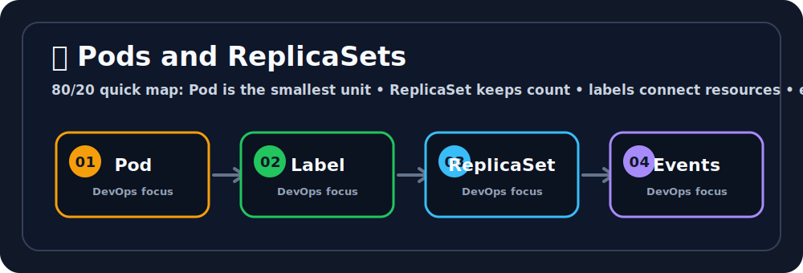

# 🔁 ReplicaSets

## Quick Visual Summary

> **80/20 Summary:** ReplicaSets keep the right number of matching Pods running.

Ravi, a ReplicaSet is like a strict team manager. 👔 It keeps the right number of matching Pods alive so your app stays available.

## Simple Definition

ReplicaSets explains how to solve one real Kubernetes problem in a practical way.

## Why do we need this?

- Kubernetes feels much easier when you learn one clear problem at a time.
- This topic shows you how to write the YAML and use the commands that matter in real life.

## Best-friend analogy

Think of a store manager who always makes sure there are enough workers on the floor.

- If one worker leaves, the manager hires another.
- The goal is to keep the staff count correct.

## Technical explanation

- Beginner: learn the basic idea and what it solves.
- Intermediate: connect the object to the controller or node that uses it.
- Advanced: understand how Kubernetes keeps desired state and actual state in sync.

## Internal architecture

- ReplicaSet stores the desired replica count.
- The selector finds matching Pods.
- The controller compares desired vs actual and fixes drift.

## Workflow

1. You write YAML.
2. kubectl sends it to the API server.
3. Kubernetes stores and reconciles the desired state.
4. The cluster makes reality match the YAML.

## ASCII diagram

`	ext
ReplicaSet
  |
  +-- Pod A
  +-- Pod B
  +-- Pod C
`

## Manifest example

`yaml
apiVersion: apps/v1
kind: ReplicaSet
metadata:
  name: rs-demo
spec:
  replicas: 3
  selector:
    matchLabels:
      app: rs-demo
  template:
    metadata:
      labels:
        app: rs-demo
    spec:
      containers:
      - name: app
        image: nginx:1.27
`

Line by line:

- piVersion tells Kubernetes which API family to use.
- kind tells Kubernetes what object you are creating.
- metadata.name gives the object a name.
- spec describes the desired state.
- `replicas` sets the desired Pod count.
- `selector` tells the controller which Pods belong to it.
- `template` describes the Pod it should create.

## kubectl commands

- `kubectl get rs` - see ReplicaSets.
- `kubectl describe rs <name>` - inspect matching rules and events.
- `kubectl scale rs <name> --replicas=5` - change replica count.

## File structure

One file like `replicaset.yaml` is enough for learning.

## Real production use cases

- Rarely used directly.
- Usually managed behind a Deployment.

## Comparison table

| ReplicaSet             | Deployment                      |
| ---------------------- | ------------------------------- |
| Keeps replicas stable  | Adds rollout and rollback       |
| Lower-level controller | Preferred production controller |

## Common mistakes

- Forgetting that Kubernetes follows desired state.
- Changing the wrong field in YAML.
- Ignoring events when troubleshooting.

## Best practices

1. Keep manifests small and readable.
2. Use one clear label pattern.
3. Check kubectl describe when something feels off.

## Troubleshooting guide

- If something does not start, read kubectl describe.
- If you need app output, read kubectl logs.
- If traffic does not flow, check selectors and endpoints.

## Top interview questions

- What does a ReplicaSet do?
- Why do labels matter so much here?
- Why do teams prefer Deployments over raw ReplicaSets?

## Quick revision bullets

- ReplicaSets is about solving one real Kubernetes problem.
- YAML declares the desired state.
- kubectl is how you observe and control it.

## One-page cheat sheet

- kubectl get ...
- kubectl describe ...
- kubectl apply -f ...

## Hands-on lab

Create a ReplicaSet, delete one Pod, and watch it come back.

## Mini project

Run a small stateless app with a ReplicaSet and scale it up and down.

## Pro tips

- If you want more than just Pods, use a controller.
- ReplicaSets are about steady count, not release safety.

## Final summary

Ravi, this topic is useful because it connects the problem, the manifest, and the commands into one simple mental model.
