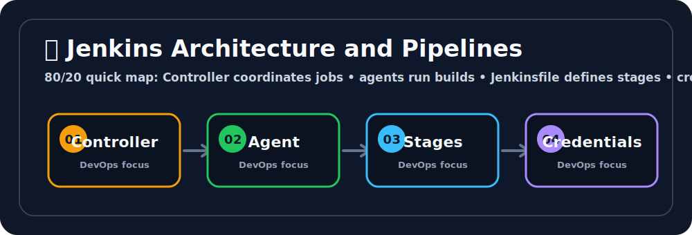

# 🧰 Jenkins Architecture and Pipelines
Ravi, this is where code turns into a little delivery robot that never forgets its job. 🤖📦


## 🖼️ Quick Visual Summary



> **⚡ 80/20 Summary:** Controller coordinates jobs • agents run builds • Jenkinsfile defines stages • credentials protect secrets

## 1. 🎯 Overview
**Jenkins** is an immensely powerful, open-source automation server. It fundamentally acts as the brain behind **Continuous Integration (CI)** and **Continuous Delivery (CD)**. When a developer pushes code to Git, Jenkins automatically wakes up, securely pulls the code, compiles it, runs automated tests, builds a Docker image, and deploys it to a Kubernetes cluster—all entirely without human intervention.

## 2. 💡 Why This Matters
- **Eliminates Manual Toil:** Engineers shouldn't be SSHing into remote production servers at 2 AM to run `npm install`. Jenkins entirely automates this dangerous manual workflow.
- **Fail Fast (CI):** If a developer writes code that accidentally breaks a core feature, Jenkins will run unit tests and automatically fail the build *before* the code is allowed to merge into the `main` branch.
- **Consistency:** Because the deployment pipeline is heavily scripted, releasing software to Production becomes a boring, predictable, 1-click button instead of a terrifying ordeal.

## 3. 🧠 Core Concepts
- **Jenkins Controller (Master):** The central nervous system. It hosts the Web UI, stores configurations, and strictly schedules jobs. It rarely executes heavy jobs itself.
- **Jenkins Agent (Node/Slave):** Worker machines commanded by the Controller. When a job triggers, the Agent does the heavy lifting (compiling Java, building Docker images).
- **Jenkinsfile:** A declarative text-based script stored identically directly in your Git repository. It contains the exact step-by-step instructions for the CI/CD pipeline.
- **Job / Pipeline:** A configured sequence of steps. Example: "Watch GitHub -> Build Code -> Run Tests -> Deploy".
- **Plugins:** Jenkins natively doesn't know what AWS or Docker is. It derives its massive power from 1,000+ community plugins that securely integrate it with external tools.

## 4. 🧭 Architecture / Workflow
1. **Developer Push:** A developer pushes code to `github.com/my-app`.
2. **Webhook Trigger:** GitHub instantly fires a secure HTTP Webhook pointing at the Jenkins Controller URL.
3. **Dispatch:** The Jenkins Controller receives the signal and intelligently assigns the job to an idle Ubuntu Jenkins Agent.
4. **Execution (Pipeline):**
   - **Stage 1 (Checkout):** The Agent pulls the source code from Git.
   - **Stage 2 (Build):** The Agent runs `npm run build`.
   - **Stage 3 (Test):** Automates quality assurance scanning.
   - **Stage 4 (Deploy):** The Agent securely logs into K8s and runs `kubectl apply`.
5. **Reporting:** Jenkins dynamically updates GitHub with a green checkmark indicating the build succeeded.

## 5. 🛠️ Commands & Practical Usage

*(Note: Jenkins is heavily GUI-driven, but beneath the surface, it pure executes shell scripts. Here are commands Jenkins executes on your behalf)*

Restarting the Jenkins service natively on a Linux machine:
```bash
sudo systemctl restart jenkins
```

Viewing the foundational Jenkins initial Administrator Password:
```bash
sudo cat /var/lib/jenkins/secrets/initialAdminPassword
```

Passing secure Jenkins credentials into an agent's shell execution:
```bash
# Jenkins injects the credential. The shell logs into Docker.
echo $DOCKER_CREDS_PSW | docker login -u $DOCKER_CREDS_USR --password-stdin
```

## 6. ⚙️ Configuration / Code Examples
A classic, production-ready Declarative `Jenkinsfile` executing a complete CI/CD Docker flow.

```groovy
pipeline {
    // Tells Jenkins to dynamically spin up a Docker container purely to run this job inside it
    agent any 
    
    environment {
        // Securely pull credentials stored deep in Jenkins' vault
        DOCKER_HUB_CREDS = credentials('docker-hub-credentials')
        IMAGE_TAG = "myapp:${env.BUILD_NUMBER}"
    }

    stages {
        stage('Checkout') {
            steps {
                // Pull code from the current Git repository
                checkout scm
            }
        }
        stage('Unit Testing') {
            steps {
                // Execute bash scripts on the agent
                sh 'echo "Running Python PyTest..."'
                sh 'python3 -m pytest tests/'
            }
        }
        stage('Docker Build & Push') {
            steps {
                // If tests pass, build the image
                sh "docker build -t ${IMAGE_TAG} ."
                sh "echo ${DOCKER_HUB_CREDS_PSW} | docker login -u ${DOCKER_HUB_CREDS_USR} --password-stdin"
                sh "docker push ${IMAGE_TAG}"
            }
        }
        stage('Deploy to K8s') {
            steps {
                // Command K8s to surgically update the live image
                sh "kubectl set image deployment/frontend-api web=${IMAGE_TAG}"
            }
        }
    }
    
    // Always execute this block regardless of success or failure
    post {
        failure {
            echo "Pipeline failed! Sending Slack alert."
        }
        success {
            echo "Pipeline succeeded!"
        }
    }
}
```

## 7. 🧪 Hands-on Step-by-Step

**Step 1: Start Jenkins locally via Docker**
```bash
docker run -p 8080:8080 -p 50000:50000 -v jenkins_home:/var/jenkins_home jenkins/jenkins:lts
```

**Step 2: Obtain the Unlock Password**
Check the terminal logs where you ran the Docker command. It will print a heavily randomized 32-character password.

**Step 3: Access the UI**
Open `http://localhost:8080`. Paste the password to unlock the Controller.

**Step 4: Install Suggested Plugins**
Click "Install Suggested Plugins". Jenkins will download tools like Git, Pipeline, and Credentials bindings. Create your Admin user.

**Step 5: Create your First Pipeline Job**
1. Click **New Item** -> Name it "My-First-Pipeline" -> Select **Pipeline** -> Click OK.
2. Scroll squarely down to the **Pipeline** script definition box.
3. Paste the exact following simple script:
```groovy
pipeline {
    agent any
    stages {
        stage('Hello') {
            steps {
                echo 'Hello World from Jenkins DevOps!'
                sh 'pwd && ls -la'
            }
        }
    }
}
```
4. Click **Save** and decisively click **Build Now**.

**Step 5: Inspect the Output**
Click on build `#1` in the History list, then select **Console Output**. You will see exactly how Jenkins allocated an agent workspace and structurally executed your `sh` shell commands securely.

## 8. 🚨 Common Errors & Troubleshooting

- **Error: `java.lang.OutOfMemoryError`**
  - **Issue:** Your Jenkins Controller mathematically ran completely out of JVM RAM because thousands of build histories are clogging memory.
  - **Fix:** Increase the Java heap size (`-Xmx2048m`) in the Jenkins systemd config and configure aggressive Job History retention limits (e.g. discard builds older than 7 days).
- **Error: `Host key verification failed` during `git checkout`**
  - **Issue:** The Jenkins agent server attempted to SSH into GitHub to clone code, but GitHub's server signature isn't trusted in the agent's `~/.ssh/known_hosts` file.
  - **Fix:** Connect to the remote agent and manually execute `ssh-keyscan github.com >> ~/.ssh/known_hosts`.
- **Error: `docker: command not found` inside a pipeline step**
  - **Issue:** The Pipeline explicitly called `sh "docker build..."`, but the physical worker agent actively running the job does not have `docker` installed on its OS.
  - **Fix:** Pre-install Docker fundamentally on the Jenkins Agent machine, and ensure the `jenkins` Linux user belongs mathematically to the `docker` user group.

## 9. ✅ Best Practices

1. **Pipeline as Code:** Never configure pipelines manually via the clicky-UI. Exclusively define them completely in a `Jenkinsfile` explicitly committed alongside your source code. If the Jenkins server burns down, your pipeline logic intimately survives perfectly in Git.
2. **Master/Slave Separation:** Never execute heavy build workloads immediately on the internal Controller (Master) node. Overloading the Controller crashes the Web UI for the entire company. Isolate workloads securely onto dedicated scalable Agents.
3. **Credential Management:** Never hardcode API tokens or passwords directly into the `Jenkinsfile` text. Utilize the Jenkins Credentials Plugin securely, storing them heavily encrypted in Jenkins, and injecting them seamlessly natively as environment variables at runtime.

## 10. 🎤 Interview Questions & Answers

**Q1: What fundamentally differs between Continuous Integration (CI) and Continuous Delivery (CD)?**
**A1:** Continuous Integration identically concerns automatically building and rigorously testing code the microsecond a developer merges it to Git, thoroughly ensuring the codebase mathematically remains unbroken. Continuous Delivery structurally takes those perfectly built artifacts (like a Docker image) and elegantly orchestrates automatically deploying them to Stage/Prod environments.

**Q2: What is undeniably the structural purpose of a Jenkinsfile?**
**A2:** It is a declarative or scripted text representation universally defining the CI/CD pipeline deeply inside the project's Git repository natively. It unequivocally achieves Infrastructure-as-Code principles flawlessly for build automation.

**Q3: Describe fundamentally how a Jenkins Webhook deeply operates.**
**A3:** Instead of Jenkins stupidly polling GitHub every 60 seconds (wasting heavy bandwidth), GitHub strictly holds a webhook URL explicitly pointing at Jenkins. When a developer actively pushes code, GitHub immediately fires an HTTP POST request to Jenkins, forcefully telling it to proactively trigger a build.

**Q4: Your Jenkins pipeline needs securely to connect to an AWS Database containing prod data. How do you intimately pass the password completely without exposing it in the GitHub repository?**
**A4:** Simply store the password definitively utilizing the Jenkins Credentials Manager. Reference the associated credential strictly by its internal ID directly inside the `environment {}` block of the `Jenkinsfile`.

**Q5: What happens securely if a single step within a Stage dynamically throws a massive error?**
**A5:** Natively, Jenkins immediately strictly fails the entire Pipeline. Furthermore, it firmly bypasses any subsequent successive stages heavily and natively executes the terminating `post { failure { ... } }` cleanup block securely explicitly.

## 11. ⚡ Quick Revision Summary
- **Jenkins:** The ultimate automation brain systematically orchestrating complex workflows.
- **Controller/Agent:** Controller acts as the GUI/Scheduler. The worker Agents systematically perform the exhausting server compilation.
- **Jenkinsfile:** Pipeline as Code natively stored permanently inside Git repositories.
- **Golden Rule:** Ensure the Controller handles fundamentally zero build work globally.

## 12. 🔗 Official Documentation Links
- [Jenkins Pipeline Documentation](https://www.jenkins.io/doc/book/pipeline/)
- [Using Jenkins Credentials](https://www.jenkins.io/doc/book/using/using-credentials/)
