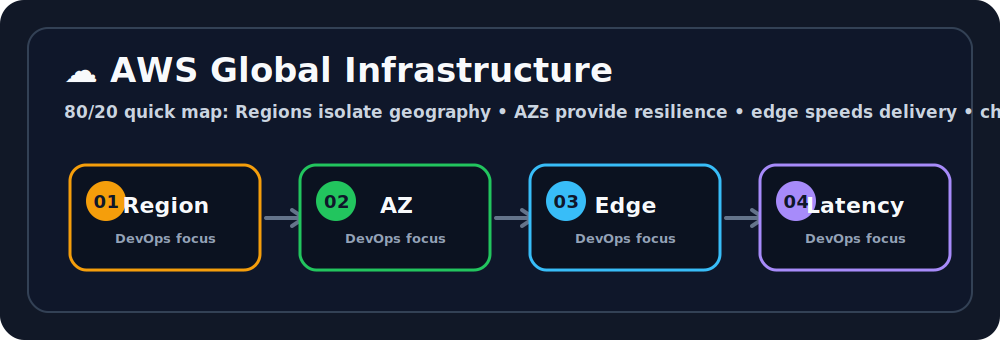

# ☁️ AWS Global Infrastructure
Ravi, think of the cloud like a giant playground in the sky where your apps get to run. ☁️🛝


## 🖼️ Quick Visual Summary



> **⚡ 80/20 Summary:** Regions isolate geography • AZs provide resilience • edge speeds delivery • choose location by latency/compliance

## 1. 🎯 Overview
Amazon Web Services (AWS) is the world's largest cloud provider, offering 200+ services across compute, storage, networking, AI, and more. Instead of buying physical servers, you rent virtual infrastructure from AWS — paying only for what you use, scaling up or down in minutes.

## 2. 💡 Why This Matters
- **No Capital Expenditure:** You don't spend $500,000 upfront on physical servers. You pay $50/month and scale when needed.
- **Global Reach in Minutes:** You can deploy your application in Tokyo, São Paulo, or Frankfurt with a single API call. No shipping hardware across continents.
- **Reliability:** AWS maintains physical data centers with redundant power, cooling, and fiber optic connections that are impossible to replicate on a startup budget.

## 3. 🧠 Core Concepts

### Regions
- A **Region** is a specific geographic location (e.g., `us-east-1` = N. Virginia, `ap-south-1` = Mumbai).
- Each Region is completely independent — disasters in one Region don't affect others.
- **Rule:** Always choose the Region closest to your users to minimize network latency.

### Availability Zones (AZs)
- Each Region contains **2–6 Availability Zones** (e.g., `us-east-1a`, `us-east-1b`, `us-east-1c`).
- An AZ is one or more physical data centers within the same Region but with separate power, cooling, and networking.
- **Rule:** Deploy your application across at least 2 AZs for high availability.

### Edge Locations (CloudFront CDN)
- 400+ edge nodes globally used by CloudFront (AWS's CDN) to cache static assets (images, JS files) close to end users.

## 4. 🧭 Architecture / Workflow
```
Planet Earth
  └── AWS Region (ap-south-1 = Mumbai)
        ├── Availability Zone A (ap-south-1a)
        │     └── Data Center 1 → Your EC2 Server
        ├── Availability Zone B (ap-south-1b)
        │     └── Data Center 2 → Your Backup EC2 Server
        └── Availability Zone C (ap-south-1c)
```

## 5. 🛠️ Commands & Practical Usage

Install the AWS CLI (prerequisite for all AWS automation):
```bash
# On Linux/Mac
curl "https://awscli.amazonaws.com/awscli-exe-linux-x86_64.zip" -o "awscliv2.zip"
unzip awscliv2.zip && sudo ./aws/install
```

Configure your IAM credentials locally:
```bash
aws configure
# AWS Access Key ID: [your-key]
# AWS Secret Access Key: [your-secret]
# Default region name: ap-south-1
# Default output format: json
```

List all available AWS Regions:
```bash
aws ec2 describe-regions --output table
```

Check who you are authenticated as:
```bash
aws sts get-caller-identity
```

## 6. ⚙️ Configuration / Code Examples
A standard AWS CLI config file (`~/.aws/config`):

```ini
[default]
region = ap-south-1
output = json

[profile production]
region = us-east-1
output = json
role_arn = arn:aws:iam::123456789012:role/ProductionDeployRole
source_profile = default
```

Switch between profiles:
```bash
export AWS_PROFILE=production
aws s3 ls  # Now runs against the Production account
```

## 7. 🧪 Hands-on Step-by-Step

**Step 1: Create a free AWS account**
Go to `https://aws.amazon.com` and click "Create a Free Account". Use a valid debit/credit card — you will NOT be charged for Free Tier usage.

**Step 2: Create an IAM User (Never use Root!)**
1. Go to IAM → Users → Add User.
2. Username: `devops-admin`.
3. Attach policy: `AdministratorAccess`.
4. Download the CSV containing the Access Key and Secret Key.

**Step 3: Install and configure AWS CLI**
```bash
aws configure
# Paste the Access Key and Secret Key from the CSV
```

**Step 4: Verify the connection works**
```bash
aws sts get-caller-identity
# Output: Your Account ID, User ARN, and User ID
```

**Step 5: List S3 buckets (Basic smoke test)**
```bash
aws s3 ls
# Output: (empty if no buckets yet — that's fine!)
```

## 8. 🚨 Common Errors & Troubleshooting

- **Error: `Unable to locate credentials`**
  - **Issue:** AWS CLI cannot find your Access Key. You haven't run `aws configure` or the credentials file is missing.
  - **Fix:** Run `aws configure` or create `~/.aws/credentials` manually.

- **Error: `An error occurred (AuthFailure)`**
  - **Issue:** Your Access Key is invalid, expired, or belongs to a different account.
  - **Fix:** Regenerate the Access Key in the IAM console.

- **Error: `An error occurred (AccessDeniedException)`**
  - **Issue:** Your IAM user does not have permission to perform that specific action.
  - **Fix:** Attach the correct IAM Policy to your user or role.

## 9. ✅ Best Practices

1. **Enable MFA on the Root account immediately.** The root account has unlimited power. If compromised, your entire cloud infrastructure is lost.
2. **Never use Root credentials for daily work.** Create an IAM user for all operations.
3. **Deploy across multiple AZs.** Single-AZ deployments are a single point of failure.
4. **Set Billing Alerts.** Go to Billing → Budgets and create a $10 alert so misconfigurations don't drain your account overnight.

## 10. 🎤 Interview Questions & Answers

**Q1: What is the difference between a Region and an Availability Zone?**
**A1:** A Region is a geographic area (like Mumbai or Virginia). An Availability Zone is an isolated physical data center within that Region. Multiple AZs give you high availability within the same geographic region.

**Q2: Why should you never use the AWS Root account for daily operations?**
**A2:** The root account has unrestricted access to everything including billing, account closure, and all AWS services. If compromised, an attacker can destroy your entire infrastructure and rack up massive bills. Use an IAM user with least-privilege permissions instead.

**Q3: What is an AWS Edge Location used for?**
**A3:** Edge Locations are nodes used by CloudFront (AWS's CDN) to cache and serve static content (images, HTML, CSS) to users from the server physically closest to them, reducing latency significantly.

**Q4: If your application is deployed in `us-east-1a` only and that AZ experiences a power failure, what happens?**
**A4:** The application goes down completely. This is why best practice is to deploy across at least 2 AZs — if one fails, the Load Balancer routes traffic to the healthy AZ automatically.

**Q5: What command verifies that your AWS CLI is properly authenticated?**
**A5:** `aws sts get-caller-identity` — It returns your Account ID, User ID, and ARN, proving the credentials are valid and working.

## 11. ⚡ Quick Revision Summary
- **Region:** Geographic location (e.g., `ap-south-1` = Mumbai).
- **AZ:** Isolated data center within a Region. Use 2+ for HA.
- **Edge Location:** CDN caching node. 400+ worldwide.
- **Golden Rule:** Root account = Emergency only. IAM users for everything else.

## 12. 🔗 Official Documentation Links
- [AWS Global Infrastructure Map](https://aws.amazon.com/about-aws/global-infrastructure/)
- [AWS CLI Configuration Guide](https://docs.aws.amazon.com/cli/latest/userguide/cli-configure-quickstart.html)
