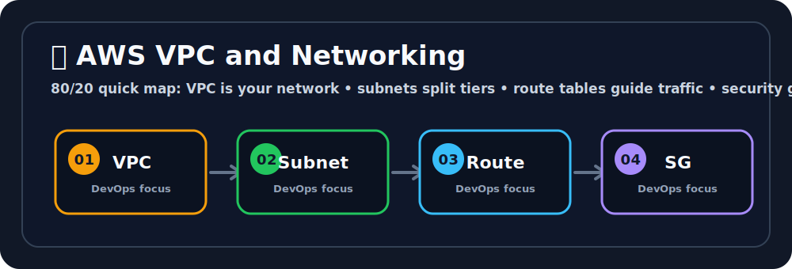

# 🕸️ AWS VPC and Networking
Ravi, think of the cloud like a giant playground in the sky where your apps get to run. ☁️🛝


## 🖼️ Quick Visual Summary



> **⚡ 80/20 Summary:** VPC is your network • subnets split tiers • route tables guide traffic • security groups filter access

## 1. 🎯 Overview
A **Virtual Private Cloud (VPC)** is your own isolated, private section of the AWS cloud. Think of it as a virtual data center you fully control. By default, nothing inside a VPC is reachable from the internet — you must explicitly open the gates. This is the foundation of all AWS network security.

## 2. 💡 Why This Matters
- **Security Isolation:** Your database servers live in a private subnet with zero internet access. Only your application servers (in a public subnet) can talk to them.
- **Traffic Control:** You decide exactly which IP ranges can enter your network and which ports are allowed.
- **Compliance:** Industries like banking and healthcare legally require network isolation — VPCs make this achievable in the cloud.

## 3. 🧠 Core Concepts

- **VPC:** Your private network. You define an IP address range using CIDR notation (e.g., `10.0.0.0/16` gives you 65,536 IP addresses).
- **Subnet:** A subdivision of your VPC within a specific AZ. Split into:
  - **Public Subnet:** Resources here can receive internet traffic (via an Internet Gateway). Put Load Balancers and web servers here.
  - **Private Subnet:** No direct internet access. Put databases and backend APIs here.
- **Internet Gateway (IGW):** The door that connects your VPC to the public internet. Attach one to your VPC to allow public subnet traffic in/out.
- **Route Table:** A set of rules defining where network traffic should be directed. Public subnets have a route to `0.0.0.0/0` via the IGW.
- **Security Group:** A stateful, instance-level virtual firewall. Controls inbound/outbound traffic for specific EC2 instances.
- **NACL (Network ACL):** A stateless, subnet-level firewall. Acts as the outer perimeter before traffic reaches Security Groups.
- **NAT Gateway:** Allows instances in a **private subnet** to initiate outbound internet connections (e.g., to download OS updates) WITHOUT allowing inbound connections from the internet.

## 4. 🧭 Architecture / Workflow

```
Internet
   │
   ▼
Internet Gateway (IGW)
   │
   ▼
VPC (10.0.0.0/16)
   ├── Public Subnet (10.0.1.0/24)  AZ-A
   │     ├── Load Balancer (receives user traffic)
   │     └── NAT Gateway (allows private subnet to reach internet)
   │
   └── Private Subnet (10.0.2.0/24)  AZ-A
         ├── Application Server EC2
         └── RDS Database (completely hidden from internet)
```

## 5. 🛠️ Commands & Practical Usage

Create a VPC with a CIDR block:
```bash
aws ec2 create-vpc --cidr-block 10.0.0.0/16 --tag-specifications \
  'ResourceType=vpc,Tags=[{Key=Name,Value=MyProdVPC}]'
```

Create a public subnet within the VPC:
```bash
aws ec2 create-subnet \
  --vpc-id vpc-0abc12345 \
  --cidr-block 10.0.1.0/24 \
  --availability-zone ap-south-1a
```

Create and attach an Internet Gateway:
```bash
aws ec2 create-internet-gateway
aws ec2 attach-internet-gateway --internet-gateway-id igw-0abc --vpc-id vpc-0abc12345
```

List all your VPCs:
```bash
aws ec2 describe-vpcs --query 'Vpcs[*].[VpcId,CidrBlock,Tags]' --output table
```

## 6. ⚙️ Configuration / Code Examples

A Security Group configuration allowing only HTTP traffic from the internet:
```bash
# Create the security group
aws ec2 create-security-group \
  --group-name WebServerSG \
  --description "Allow HTTP from internet" \
  --vpc-id vpc-0abc12345

# Allow inbound HTTP (port 80) from all IPs
aws ec2 authorize-security-group-ingress \
  --group-id sg-0abc12345 \
  --protocol tcp \
  --port 80 \
  --cidr 0.0.0.0/0

# Allow inbound HTTPS (port 443) from all IPs
aws ec2 authorize-security-group-ingress \
  --group-id sg-0abc12345 \
  --protocol tcp \
  --port 443 \
  --cidr 0.0.0.0/0
```

## 7. 🧪 Hands-on Step-by-Step

**Step 1: Create a VPC via the AWS Console**
1. Go to **VPC** → **Your VPCs** → **Create VPC**.
2. Name: `learning-vpc`, IPv4 CIDR: `10.0.0.0/16`. Click Create.

**Step 2: Create a Public Subnet**
1. Go to **Subnets** → **Create Subnet**.
2. VPC: `learning-vpc`, Subnet name: `public-subnet-1a`.
3. AZ: `ap-south-1a`, CIDR: `10.0.1.0/24`. Click Create.

**Step 3: Enable Auto-assign Public IPs for the public subnet**
Select the subnet → Actions → Edit subnet settings → Enable auto-assign public IPv4.

**Step 4: Create and Attach an Internet Gateway**
1. Go to **Internet Gateways** → **Create internet gateway**.
2. Name: `learning-igw`. Create, then **Actions → Attach to VPC** → select `learning-vpc`.

**Step 5: Update the Route Table**
1. Go to **Route Tables**, find the one for your VPC.
2. Click **Routes → Edit routes → Add route**.
3. Destination: `0.0.0.0/0`, Target: `learning-igw`. Save.

Your public subnet is now fully connected to the internet!

## 8. 🚨 Common Errors & Troubleshooting

- **Error: EC2 has a public IP but still not reachable from browser**
  - **Issue:** The Security Group does not allow inbound traffic on Port 80 or 443.
  - **Fix:** Edit the Security Group's Inbound Rules and add `HTTP (port 80)` from `0.0.0.0/0`.

- **Error: Private EC2 instance cannot download updates (`curl: timeout`)**
  - **Issue:** Private subnet instances have no internet route. They can't reach `apt.ubuntu.com`.
  - **Fix:** Create a NAT Gateway in the public subnet, and add a route in the **private subnet's** route table: `0.0.0.0/0 → NAT Gateway`.

- **Error: Two EC2 instances in the same VPC cannot communicate**
  - **Issue:** Their Security Groups don't allow traffic from each other.
  - **Fix:** In each Security Group, add an inbound rule allowing traffic from the **other SG's ID** (not an IP — this is the proper AWS pattern).

## 9. ✅ Best Practices

1. **Never put databases in public subnets.** There is no legitimate reason for your RDS instance to be directly reachable from the internet.
2. **Use Security Groups, not NACLs, as your primary firewall.** Security Groups are stateful (they automatically allow return traffic) and much easier to reason about.
3. **Use separate VPCs for Production, Staging, and Dev.** Mistakes in Dev should never be able to affect Prod networking.
4. **Tag everything.** Resources without tags are impossible to audit months later.

## 10. 🎤 Interview Questions & Answers

**Q1: What is the difference between a Security Group and a NACL?**
**A1:** A Security Group is stateful (allows return traffic automatically) and applies at the instance level. A NACL is stateless (you must explicitly allow both request and response traffic) and applies at the subnet level. Security Groups are generally your main line of defense.

**Q2: What is the difference between a Public Subnet and a Private Subnet?**
**A2:** A Public Subnet has a route to an Internet Gateway in its Route Table, allowing resources to receive traffic from the internet. A Private Subnet has no such route — it is completely isolated from the internet.

**Q3: Why do you need a NAT Gateway if your private instances need to download software?**
**A3:** Without a NAT Gateway, private subnet instances have zero outbound internet connectivity. The NAT Gateway lets them initiate outbound connections (e.g., `apt-get update`) while remaining completely unreachable from the internet inbound.

**Q4: You create an EC2 instance in a public subnet but it has no public IP. How do you fix this?**
**A4:** Either enable "Auto-assign Public IP" at the subnet level (for all future instances), or allocate an Elastic IP (EIP) and associate it directly with that specific EC2 instance.

**Q5: What is VPC Peering?**
**A5:** VPC Peering creates a private network connection between two VPCs, allowing resources in each to communicate using private IP addresses as if they were in the same network. Useful for connecting a Dev VPC to a shared Monitoring VPC.

## 11. ⚡ Quick Revision Summary
- **VPC:** Your private AWS network. CIDR defines the IP range.
- **Public Subnet:** Has route to IGW. Load balancers and web servers live here.
- **Private Subnet:** No internet route. Databases and APIs live here.
- **Security Group:** Stateful instance-level firewall.
- **NAT Gateway:** Lets private instances reach the internet (outbound only).

## 12. 🔗 Official Documentation Links
- [Amazon VPC User Guide](https://docs.aws.amazon.com/vpc/latest/userguide/what-is-amazon-vpc.html)
- [Security Groups for your VPC](https://docs.aws.amazon.com/vpc/latest/userguide/VPC_SecurityGroups.html)
