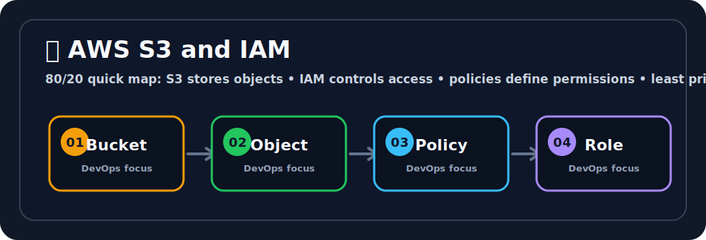

# 🪣 AWS S3 and IAM
Ravi, think of the cloud like a giant playground in the sky where your apps get to run. ☁️🛝


## 🖼️ Quick Visual Summary



> **⚡ 80/20 Summary:** S3 stores objects • IAM controls access • policies define permissions • least privilege prevents leaks

## 1. 🎯 Overview
**S3 (Simple Storage Service)** is AWS's infinitely scalable object storage. You store files (objects) in containers (buckets) — and S3 handles durability, redundancy, and global accessibility automatically. **IAM (Identity and Access Management)** is the security control plane for ALL of AWS — it defines *who* can do *what* to *which* resources.

## 2. 💡 Why This Matters

**S3:**
- Store Docker image layers, Terraform state files, application logs, static website assets, and database backups — all in one highly durable place.
- 99.999999999% (11 nines) durability. AWS stores your data across 3+ AZs automatically.

**IAM:**
- Without IAM, anyone with your AWS account credentials could delete every server, drain your account, and steal your data.
- IAM implements the **Principle of Least Privilege** — each user, role, and service gets only the minimum permissions it needs to function.

## 3. 🧠 Core Concepts

### S3 Concepts
- **Bucket:** A globally unique container for storing objects. Buckets live in a specific Region.
- **Object:** Any file you store (image, video, zip, JSON). Max size per object: 5 TB.
- **Object Key:** The full path/name of the object (e.g., `logs/2026/april/app.log`).
- **Bucket Versioning:** Keeps every version of an object. Enables recovery from accidental deletions.
- **Storage Classes:** Different pricing tiers — `Standard` (frequent access), `Infrequent Access`, `Glacier` (archival).
- **Bucket Policy:** A JSON-based resource policy defining who can access the bucket.

### IAM Concepts
- **IAM User:** A permanent identity for humans (developers, admins) needing long-term API credentials.
- **IAM Group:** A collection of users sharing the same permissions (e.g., `Developers`, `DevOpsTeam`).
- **IAM Role:** A temporary identity assumed by AWS services (EC2, Lambda) or external users. No permanent credentials.
- **IAM Policy:** A JSON document defining Allow/Deny permissions on specific AWS actions and resources.
- **IAM Policy Types:**
  - **Managed Policy:** AWS-prepared or customer-created. Reusable, can be attached to many identities.
  - **Inline Policy:** Embedded directly in a single user/role. Disappears when the identity is deleted.

## 4. 🧭 Architecture / Workflow

**S3 Upload Flow:**
```
App Server  →  AWS SDK / CLI
                    │
                    ▼
            S3 API Endpoint
                    │
                    ▼
            S3 Bucket (ap-south-1)
                    │  (Automatically replicated across 3+ AZs)
              Object Stored
```

**IAM Permission Check Flow:**
```
CI/CD Pipeline calls: aws s3 cp artifact.zip s3://my-bucket/
         │
         ▼
  IAM evaluates: Does the caller's Role/User have s3:PutObject permission on this bucket?
         │         
   YES → Allow     NO → AccessDenied (403)
```

## 5. 🛠️ Commands & Practical Usage

Create an S3 bucket:
```bash
aws s3 mb s3://my-devops-artifacts-2026 --region ap-south-1
```

Upload a file to S3:
```bash
aws s3 cp ./build/app.zip s3://my-devops-artifacts-2026/releases/app-v1.0.zip
```

Download a file from S3:
```bash
aws s3 cp s3://my-devops-artifacts-2026/releases/app-v1.0.zip ./app.zip
```

Sync an entire folder to S3 (for static websites):
```bash
aws s3 sync ./dist/ s3://my-website-bucket/ --delete
```

List bucket contents:
```bash
aws s3 ls s3://my-devops-artifacts-2026/ --recursive --human-readable
```

Create an IAM user:
```bash
aws iam create-user --user-name jenkins-deployer
```

Attach a policy to the user:
```bash
aws iam attach-user-policy \
  --user-name jenkins-deployer \
  --policy-arn arn:aws:iam::aws:policy/AmazonS3FullAccess
```

## 6. ⚙️ Configuration / Code Examples

**S3 Bucket Policy** — Allow only a specific IAM Role to read objects:
```json
{
  "Version": "2012-10-17",
  "Statement": [
    {
      "Sid": "AllowECReadOnly",
      "Effect": "Allow",
      "Principal": {
        "AWS": "arn:aws:iam::123456789012:role/EC2AppRole"
      },
      "Action": [
        "s3:GetObject",
        "s3:ListBucket"
      ],
      "Resource": [
        "arn:aws:s3:::my-devops-artifacts-2026",
        "arn:aws:s3:::my-devops-artifacts-2026/*"
      ]
    }
  ]
}
```

**Custom IAM Policy** — Allows an application to read from S3 and write to DynamoDB only:
```json
{
  "Version": "2012-10-17",
  "Statement": [
    {
      "Effect": "Allow",
      "Action": [
        "s3:GetObject",
        "s3:GetObjectVersion"
      ],
      "Resource": "arn:aws:s3:::my-configs-bucket/*"
    },
    {
      "Effect": "Allow",
      "Action": [
        "dynamodb:PutItem",
        "dynamodb:GetItem"
      ],
      "Resource": "arn:aws:dynamodb:ap-south-1:123456789012:table/AppTable"
    }
  ]
}
```

## 7. 🧪 Hands-on Step-by-Step

**Step 1: Create an S3 Bucket for Terraform State**
```bash
aws s3 mb s3://my-terraform-state-$(date +%s) --region ap-south-1
```

**Step 2: Enable versioning** (Critical for Terraform state)
```bash
aws s3api put-bucket-versioning \
  --bucket my-terraform-state-XXXXX \
  --versioning-configuration Status=Enabled
```

**Step 3: Create an IAM Role for EC2**
```bash
# 1. Create the trust policy file
cat > trust-policy.json << 'EOF'
{
  "Version": "2012-10-17",
  "Statement": [{
    "Effect": "Allow",
    "Principal": {"Service": "ec2.amazonaws.com"},
    "Action": "sts:AssumeRole"
  }]
}
EOF

# 2. Create the role
aws iam create-role --role-name MyEC2Role \
  --assume-role-policy-document file://trust-policy.json
```

**Step 4: Attach S3 read permissions to the Role**
```bash
aws iam attach-role-policy \
  --role-name MyEC2Role \
  --policy-arn arn:aws:iam::aws:policy/AmazonS3ReadOnlyAccess
```

**Step 5: Attach the Role to your EC2 instance**
In EC2 Console → Select instance → Actions → Security → Modify IAM Role → Select `MyEC2Role`.

**Step 6: Test — SSH into EC2 and access S3 without any credentials!**
```bash
ssh -i my-key.pem ubuntu@<EC2-IP>
aws s3 ls  # Works! No Access Key needed — the Role provides credentials automatically.
```

## 8. 🚨 Common Errors & Troubleshooting

- **Error: `An error occurred (AccessDenied) when calling the PutObject operation`**
  - **Issue:** The IAM user or role attempting to upload lacks `s3:PutObject` permission on that specific bucket.
  - **Fix:** Attach a policy granting `s3:PutObject` on `arn:aws:s3:::bucket-name/*`.

- **Error: `BucketAlreadyExists` when creating a bucket**
  - **Issue:** S3 bucket names are globally unique across ALL AWS accounts worldwide. Someone else already owns that name.
  - **Fix:** Add a random suffix or your account ID: `my-bucket-$(date +%s)`.

- **Error: IAM Role attached to EC2 but still getting `Unable to locate credentials`**
  - **Issue:** The EC2 instance metadata service (IMDS) might be disabled on that instance.
  - **Fix:** Check EC2 → Instance Settings → Modify Instance Metadata Options → ensure IMDS is `Enabled`.

## 9. ✅ Best Practices

1. **Block all public access on S3 buckets by default.** AWS provides a single toggle — "Block Public Access" — use it on every bucket unless it's explicitly a public static website.
2. **Enable S3 Versioning for critical buckets** (Terraform state, deployment artifacts). It costs slightly more but allows instant recovery from accidental overwrites or deletions.
3. **Use IAM Roles everywhere, not IAM Users with Access Keys.** Users with keys are a permanent credential leak risk. Roles use time-limited temporary credentials auto-rotated by AWS.
4. **Apply the Principle of Least Privilege.** Don't give `AdministratorAccess` to a service that only needs to read one S3 bucket.

## 10. 🎤 Interview Questions & Answers

**Q1: What makes S3 different from EBS?**
**A1:** EBS is a network-attached block device — it behaves like a hard drive and can only be attached to one EC2 instance at a time. S3 is object storage accessible via HTTP API from anywhere (EC2, Lambda, on-premise, your laptop). S3 scales infinitely; EBS has a maximum size.

**Q2: What is an IAM Role and how does it differ from an IAM User?**
**A2:** An IAM User represents a person with permanent long-term credentials (Access Key + Secret). An IAM Role is a set of permissions that any trusted entity (EC2, Lambda, another AWS account) can temporarily assume. Roles issue short-lived, automatically rotating credentials — dramatically safer than static user keys.

**Q3: If you accidentally delete an important S3 object, how do you recover it?**
**A3:** If versioning was enabled on the bucket, the deletion only placed a "delete marker." You can restore the previous version by removing the delete marker in the S3 console or via `aws s3api delete-object --version-id <delete-marker-id>`.

**Q4: An EC2 instance runs a Python script that calls `boto3.client('s3').put_object(...)`. What is the most secure way to provide AWS credentials to the script?**
**A4:** Attach an IAM Role to the EC2 instance with `s3:PutObject` permissions. The `boto3` SDK automatically discovers the role credentials from the EC2 Instance Metadata Service (IMDS) without needing any hardcoded keys.

**Q5: Explain the difference between an IAM Policy attached to a user vs. an S3 Bucket Policy.**
**A5:** An IAM User Policy (identity-based policy) is attached to the IAM user and defines what that user can do across AWS. An S3 Bucket Policy (resource-based policy) is attached to the bucket and defines who can access that specific bucket. Both must be satisfied for cross-account access. For same-account access, either alone is sufficient.

## 11. ⚡ Quick Revision Summary
- **S3:** Infinitely scalable object storage. Buckets → Objects → Keys.
- **IAM User:** A person. Has Access Key + Secret (permanent).
- **IAM Role:** A machine/service identity. Temporary credentials, auto-rotated.
- **IAM Policy:** JSON permissions document (Allow/Deny on Actions + Resources).
- **Golden Rule:** Block public S3 access. Use Roles, not User keys, on servers.

## 12. 🔗 Official Documentation Links
- [Amazon S3 User Guide](https://docs.aws.amazon.com/AmazonS3/latest/userguide/Welcome.html)
- [IAM Best Practices](https://docs.aws.amazon.com/IAM/latest/UserGuide/best-practices.html)
