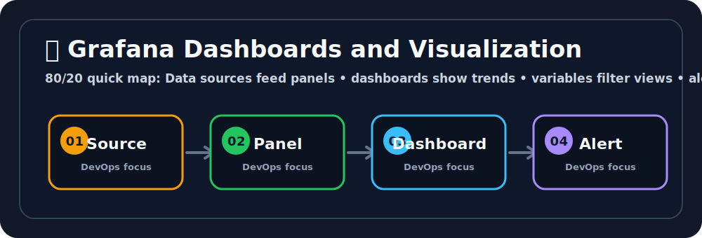

# 📊 Grafana Dashboards and Visualization


## 🖼️ Quick Visual Summary



> **⚡ 80/20 Summary:** Data sources feed panels • dashboards show trends • variables filter views • alerts notify teams

## 1. 🎯 Overview
**Grafana** is the industry-standard open-source platform for metrics visualization and observability dashboards. While Prometheus collects and stores raw metrics, Grafana is the rich visualization layer on top — turning numbers in a database into beautiful, real-time, interactive dashboards that engineers and executives can actually understand at a glance.

## 2. 💡 Why This Matters
- **Central Observability Hub:** Grafana can connect to dozens of data sources simultaneously — Prometheus, AWS CloudWatch, Loki (logs), Elasticsearch, MySQL, InfluxDB — all in one unified dashboard.
- **Real-Time Decision Making:** During a production outage, a well-designed Grafana dashboard lets you see in 5 seconds whether the issue is CPU saturation, a memory leak, high error rates, or a network problem — instead of running dozens of CLI commands.
- **Alerting:** Grafana has its own alerting engine that can fire notifications directly to Slack, PagerDuty, and email based on dashboard panel queries.

## 3. 🧠 Core Concepts

- **Data Source:** The database Grafana queries. You connect Grafana to Prometheus, CloudWatch, MySQL, Loki, etc. One Grafana instance can query many sources simultaneously.
- **Dashboard:** A collection of organized panels displaying related metrics (e.g., "Kubernetes Node Overview" showing CPU, Memory, Disk, and Network in one view).
- **Panel:** A single visualization unit within a dashboard — a graph, stat, gauge, table, heatmap, or alert list.
- **Panel Types:**
  | Type | Best For |
  |---|---|
  | **Time series** | CPU usage over time, request rates |
  | **Stat** | Single current value (e.g., "Current Uptime") |
  | **Gauge** | Percentage values (disk usage, memory %) |
  | **Bar chart** | Comparing values across categories |
  | **Table** | Tabular data with multiple columns |
  | **Heatmap** | Latency distributions over time |
- **Variables (Template Variables):** Dropdown filters at the top of a dashboard that make it interactive (e.g., filter all panels by `$server` or `$namespace`).
- **Annotations:** Markers on a time-series graph indicating events — like deploy times, restarts, or incidents — for correlation analysis.

## 4. 🧭 Architecture / Workflow

```
Data Sources          Grafana Core          Users
────────────          ────────────          ─────
Prometheus    ──┐
CloudWatch    ──┤──→  Query Engine  ──→  Dashboard Editor
MySQL         ──┤       (PromQL,          (Panels, Variables,
Loki (Logs)   ──┘        SQL, etc.)        Annotations)
                              │
                              ▼
                      Alert Engine  ──→  Slack / PagerDuty / Email
```

## 5. 🛠️ Commands & Practical Usage

Run Grafana via Docker (fastest way to start):
```bash
docker run -d \
  --name grafana \
  -p 3000:3000 \
  -v grafana_data:/var/lib/grafana \
  grafana/grafana:latest
```

Run Grafana via Docker Compose alongside Prometheus:
```yaml
services:
  grafana:
    image: grafana/grafana:latest
    ports:
      - "3000:3000"
    environment:
      - GF_SECURITY_ADMIN_PASSWORD=devops123  # Set admin password
      - GF_USERS_ALLOW_SIGN_UP=false          # Disable self-registration
    volumes:
      - grafana_data:/var/lib/grafana
      - ./grafana/provisioning:/etc/grafana/provisioning  # Auto-provision datasources
    depends_on:
      - prometheus
```

Provision a Prometheus data source automatically (no manual UI clicking):

**`./grafana/provisioning/datasources/prometheus.yml`**:
```yaml
apiVersion: 1

datasources:
  - name: Prometheus
    type: prometheus
    url: http://prometheus:9090
    isDefault: true
    access: proxy
    editable: false
```

## 6. ⚙️ Configuration / Code Examples

**Dashboard JSON Model (simplified)** — A panel showing CPU usage:
```json
{
  "title": "CPU Usage %",
  "type": "timeseries",
  "targets": [
    {
      "expr": "100 - (avg by (instance) (rate(node_cpu_seconds_total{mode='idle'}[5m])) * 100)",
      "legendFormat": "{{instance}}",
      "datasource": "Prometheus"
    }
  ],
  "fieldConfig": {
    "defaults": {
      "unit": "percent",
      "min": 0,
      "max": 100,
      "thresholds": {
        "steps": [
          { "value": 0,  "color": "green" },
          { "value": 70, "color": "yellow" },
          { "value": 90, "color": "red" }
        ]
      }
    }
  }
}
```

**Alert Rule in Grafana** — Notify Slack when error rate is high:
```yaml
# Configured via Grafana UI: Alerting → Alert Rules → New Rule
# PromQL Expression:
sum(rate(http_requests_total{status=~"5.."}[5m])) > 0.5

# Conditions:
# - Evaluate every: 1m
# - For: 5m
# - Send to: Slack channel #alerts
```

## 7. 🧪 Hands-on Step-by-Step

**Step 1: Launch the full monitoring stack**

Add Grafana to your `docker-compose.yml` from the Prometheus notes:
```yaml
  grafana:
    image: grafana/grafana:latest
    ports:
      - "3000:3000"
    environment:
      - GF_SECURITY_ADMIN_PASSWORD=admin123
    volumes:
      - grafana_data:/var/lib/grafana
    depends_on:
      - prometheus

volumes:
  prometheus_data:
  grafana_data:
```
```bash
docker-compose up -d
```

**Step 2: Log in to Grafana**
Open `http://localhost:3000`. Login: `admin` / `admin123`.

**Step 3: Add Prometheus as a Data Source**
1. Go to **Connections → Data Sources → Add data source**.
2. Select **Prometheus**.
3. URL: `http://prometheus:9090`.
4. Click **Save & Test** → You should see "Data source is working" ✅.

**Step 4: Import a pre-built dashboard**
Instead of building from scratch, import the famous "Node Exporter Full" dashboard:
1. Go to **Dashboards → Import**.
2. Enter Dashboard ID: **`1860`** (from grafana.com/dashboards).
3. Select your Prometheus data source.
4. Click **Import**.

You now have a **professional, comprehensive dashboard** showing CPU, Memory, Disk I/O, Network, and more — instantly.

**Step 5: Explore and customize**
- Click any panel → **Edit** to modify the underlying PromQL query.
- Add a **Template Variable** for `$instance` to filter by specific servers.
- Set a **display name**, **unit** (percentage, bytes, requests/sec), and **color thresholds**.

**Step 6: Set up a Slack alert**
1. Go to **Alerting → Contact Points → Add contact point**.
2. Select type: **Slack**, paste your Slack Webhook URL.
3. Go to a panel → **Edit → Alert tab → Create alert rule**.
4. Set the condition and point it to your Slack contact point.

## 8. 🚨 Common Errors & Troubleshooting

- **Error: `No data` on a panel after adding a PromQL query**
  - **Issue 1:** The time range selected in the top-right corner is too narrow (e.g., last 5 minutes) and the metric didn't have data in that window.
  - **Issue 2:** The Prometheus data source URL is wrong (e.g., using `localhost:9090` instead of `prometheus:9090` when Grafana is inside Docker).
  - **Fix:** Expand the time range. Verify the data source URL. Test the PromQL directly in the Prometheus UI first.

- **Error: Dashboard panels show correct data but alerts never fire**
  - **Issue:** The alert evaluation time range or `for` duration is not aligned with how your metric is computed. Also, Grafana alerts may fire but AlertManager silences them.
  - **Fix:** Check **Alerting → Alert Rules** to see the alert state (`Normal`, `Pending`, `Firing`). Check **Alerting → Silences** to ensure nothing is muted.

- **Error: Grafana shows `Err: context deadline exceeded` on slow queries**
  - **Issue:** A PromQL query (especially with `increase()` or `histogram_quantile()` over a long range) is taking too long to evaluate on the Prometheus server.
  - **Fix:** Shorten the query time range. Use `recording rules` in Prometheus to pre-compute expensive queries so Grafana retrieves cached results.

## 9. ✅ Best Practices

1. **Use the Grafana Dashboard Library.** Don't waste time building standard dashboards from scratch. Import community dashboards for Kubernetes (ID: 13770), Node Exporter (ID: 1860), and Nginx (ID: 9614) from `grafana.com/grafana/dashboards`.
2. **Use Template Variables for multi-server dashboards.** A dashboard with a `$host` dropdown variable that filters all panels is 100x more useful than separate dashboards per server.
3. **Version control your dashboards.** Export dashboards as JSON and commit them to Git. Use Grafana's provisioning feature to auto-load them on startup via the `provisioning/dashboards/` folder.
4. **Separate signal from noise.** A dashboard crammed with 50 panels is useless during an incident. Build focused dashboards: one for infrastructure, one for application, one for business metrics (like orders per minute).

## 10. 🎤 Interview Questions & Answers

**Q1: What is the difference between Prometheus and Grafana — can one work without the other?**
**A1:** Yes. Prometheus collects and stores time-series metrics data and has its own basic expression browser UI. Grafana is purely a visualization layer — it doesn't collect data, it only queries existing data sources. They are complementary: Prometheus is the engine, Grafana is the dashboard. You can also use Grafana with CloudWatch, MySQL, or any other data source without Prometheus.

**Q2: What is a Template Variable in Grafana?**
**A2:** A Template Variable is a dashboard-level dropdown filter. For example, a `$namespace` variable populated from the query `label_values(kube_pod_info, namespace)` creates a dropdown at the top of the dashboard. All panels that reference `$namespace` in their PromQL will automatically filter to show data only for the selected namespace.

**Q3: How do you make Grafana dashboards survive container restarts?**
**A3:** Mount a Docker Volume to `/var/lib/grafana` to persist Grafana's SQLite database (which stores dashboards, users, and data source configs). Better yet, use Grafana's **provisioning** feature to define data sources and dashboards as YAML/JSON files in the container's provisioning directory — this is fully GitOps-compatible.

**Q4: What is a Recording Rule in Prometheus and why does it help Grafana?**
**A4:** A Recording Rule is a pre-computed PromQL query that Prometheus evaluates on a schedule and stores the result as a new metric. Expensive queries (like `histogram_quantile` over 24 hours) that take 10+ seconds to compute become instant in Grafana because Grafana queries the pre-computed result metric instead of recalculating from raw data.

**Q5: During a production incident, what is the most important Grafana dashboard you should have ready?**
**A5:** A **RED Method** dashboard — **R**ate (requests per second), **E**rrors (error rate %), **D**uration (latency percentiles p50/p95/p99) — for each critical service. This instantly tells you whether a service is degraded, how many customers are affected, and how slow responses have become, without digging through logs.

## 11. ⚡ Quick Revision Summary
- **Grafana:** Visualization layer. Queries data sources, renders dashboards.
- **Panel:** Single visualization (graph, stat, gauge, table).
- **Data Source:** Where data comes from (Prometheus, CloudWatch, MySQL).
- **Template Variables:** Dropdown filters that make dashboards interactive.
- **Pro-tip:** Import community dashboard ID `1860` for Node Exporter Full instantly.

## 12. 🔗 Official Documentation Links
- [Grafana Official Documentation](https://grafana.com/docs/grafana/latest/)
- [Grafana Dashboard Provisioning](https://grafana.com/docs/grafana/latest/administration/provisioning/)
- [Grafana Public Dashboard Library](https://grafana.com/grafana/dashboards/)
