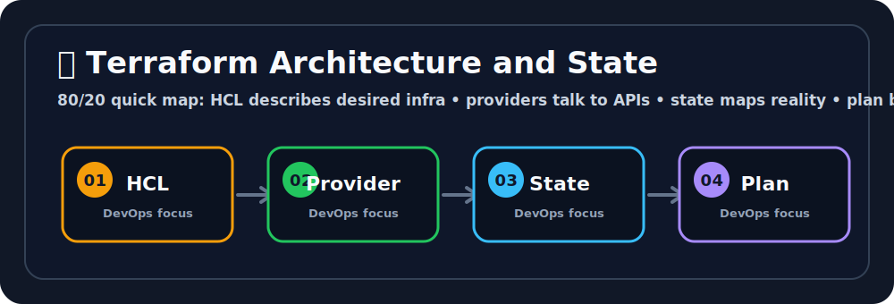

# 🏗️ Terraform Architecture and State
Ravi, this is the LEGO set for infrastructure, but with fewer missing pieces. 🧱😄


## 🖼️ Quick Visual Summary



> **⚡ 80/20 Summary:** HCL describes desired infra • providers talk to APIs • state maps reality • plan before apply

## 1. 🎯 Overview
**Terraform** is an open-source **Infrastructure as Code (IaC)** tool by HashiCorp. Instead of manually clicking through the AWS console to create servers, VPCs, and databases, you write human-readable configuration files (`.tf` files). Terraform reads these files and automatically provisions, modifies, or destroys the cloud infrastructure to match your declared state.

## 2. 💡 Why This Matters
- **Reproducibility:** The same Terraform code that created your Dev environment can create an identical Production environment in a different AWS region with one command.
- **Version Control:** Your entire infrastructure is committed to Git. You can see exactly who changed what firewall rule and when, and roll back if needed.
- **Drift Detection:** Terraform tracks the exact state of your infrastructure. If someone manually changes a Security Group in the console, Terraform will detect the drift and alert you.
- **Multi-Cloud:** The same tool works with AWS, Azure, GCP, Kubernetes, Datadog, GitHub — 3,000+ providers.

## 3. 🧠 Core Concepts

- **Provider:** A plugin that tells Terraform how to talk to a specific platform (e.g., `hashicorp/aws` provider knows all AWS API calls).
- **Resource:** The fundamental building block. Declares a specific piece of infrastructure to create (e.g., `aws_instance`, `aws_s3_bucket`).
- **State File (`terraform.tfstate`):** A JSON file where Terraform records the mapping between your configuration and the real-world resources it created. This is Terraform's memory.
- **Plan:** A dry-run preview (`terraform plan`) showing exactly what Terraform will create, modify, or destroy — before touching anything.
- **Apply:** The actual execution (`terraform apply`) that calls the cloud APIs to make changes.
- **Backend:** Where the state file is stored. Locally by default, but in production always stored in a remote backend (S3 + DynamoDB for AWS).

## 4. 🧭 Architecture / Workflow

```
You write .tf files
        │
        ▼
terraform init      → Downloads provider plugins (stores in .terraform/)
        │
        ▼
terraform plan      → Compares .tf files vs. current state file
                      Shows: what will be Created / Modified / Destroyed
        │
        ▼
terraform apply     → Calls AWS/GCP/Azure APIs to make it real
                      Updates terraform.tfstate with new reality
        │
        ▼
terraform destroy   → Tears down everything Terraform created
```

## 5. 🛠️ Commands & Practical Usage

Initialize a working directory (downloads providers):
```bash
terraform init
```

Preview planned changes without making them:
```bash
terraform plan
# Save the plan to a file for safer apply
terraform plan -out=tfplan
```

Apply the changes (create/modify/destroy infrastructure):
```bash
terraform apply
# Apply a saved plan file (no confirmation prompt)
terraform apply tfplan
```

Destroy all resources managed by this configuration:
```bash
terraform destroy
```

Check for configuration syntax errors:
```bash
terraform validate
```

Format all `.tf` files to canonical style:
```bash
terraform fmt
```

Show the current state:
```bash
terraform show
terraform state list
```

## 6. ⚙️ Configuration / Code Examples

**Complete working example** — Creates an S3 bucket with versioning using remote state:

```hcl
# versions.tf — Pin providers for reproducibility
terraform {
  required_version = ">= 1.5.0"

  required_providers {
    aws = {
      source  = "hashicorp/aws"
      version = "~> 5.0"
    }
  }

  # Remote backend: Store state in S3, use DynamoDB for locking
  backend "s3" {
    bucket         = "my-terraform-state-bucket"
    key            = "prod/app/terraform.tfstate"
    region         = "ap-south-1"
    dynamodb_table = "terraform-state-lock"
    encrypt        = true
  }
}

# providers.tf — Configure the AWS provider
provider "aws" {
  region = "ap-south-1"
}

# main.tf — Define actual resources
resource "aws_s3_bucket" "artifacts" {
  bucket = "my-app-artifacts-2026"

  tags = {
    Environment = "production"
    ManagedBy   = "terraform"
  }
}

resource "aws_s3_bucket_versioning" "artifacts" {
  bucket = aws_s3_bucket.artifacts.id

  versioning_configuration {
    status = "Enabled"
  }
}
```

## 7. 🧪 Hands-on Step-by-Step

**Step 1: Install Terraform**
```bash
# On Ubuntu/Debian
wget -O- https://apt.releases.hashicorp.com/gpg | sudo gpg --dearmor -o /usr/share/keyrings/hashicorp-archive-keyring.gpg
echo "deb [signed-by=/usr/share/keyrings/hashicorp-archive-keyring.gpg] https://apt.releases.hashicorp.com $(lsb_release -cs) main" | sudo tee /etc/apt/sources.list.d/hashicorp.list
sudo apt update && sudo apt install terraform

# Verify
terraform version
```

**Step 2: Create your first project**
```bash
mkdir tf-lab && cd tf-lab
```

**Step 3: Create `main.tf`**
```hcl
terraform {
  required_providers {
    aws = {
      source  = "hashicorp/aws"
      version = "~> 5.0"
    }
  }
}

provider "aws" {
  region = "ap-south-1"
}

resource "aws_vpc" "my_vpc" {
  cidr_block = "10.0.0.0/16"

  tags = {
    Name = "terraform-learning-vpc"
  }
}

output "vpc_id" {
  value = aws_vpc.my_vpc.id
}
```

**Step 4: Initialize**
```bash
terraform init
# Terraform downloads the AWS provider plugin
```

**Step 5: Preview**
```bash
terraform plan
# You will see: Plan: 1 to add, 0 to change, 0 to destroy.
```

**Step 6: Apply and observe**
```bash
terraform apply
# Type 'yes' when prompted
# Check your AWS console — the VPC now exists!
```

**Step 7: Clean up**
```bash
terraform destroy
# Type 'yes' — Terraform deletes the VPC cleanly
```

## 8. 🚨 Common Errors & Troubleshooting

- **Error: `Error: No valid credential sources found`**
  - **Issue:** Terraform cannot find your AWS credentials.
  - **Fix:** Run `aws configure` to set up credentials, or set environment variables: `export AWS_ACCESS_KEY_ID=xxx && export AWS_SECRET_ACCESS_KEY=yyy`.

- **Error: `Error acquiring the state lock`**
  - **Issue:** A previous `terraform apply` crashed and left a lock in DynamoDB, OR another team member is running apply simultaneously.
  - **Fix:** If you are sure no one else is running apply, force-unlock using `terraform force-unlock <LOCK_ID>` (found in the error message).

- **Error: `Resource already exists` during apply**
  - **Issue:** You are trying to create a resource (e.g., S3 bucket) that already exists in AWS but NOT in your state file. Terraform doesn't know about it.
  - **Fix:** Import the existing resource into state: `terraform import aws_s3_bucket.my_bucket existing-bucket-name`.

## 9. ✅ Best Practices

1. **Always use Remote State in production.** A local `terraform.tfstate` file on your laptop is a single point of failure. Store it in S3 with DynamoDB locking so your entire team shares the same state safely.
2. **Never manually edit the state file.** Use `terraform state mv`, `terraform state rm`, and `terraform import`. Hand-editing JSON in the state file leads to corruption.
3. **Always run `terraform plan` before `terraform apply`.** The plan output is your safety net. Review every `+`, `~`, and `−` before confirming.
4. **Use workspaces or separate state files per environment.** Never use the same state file for both Dev and Production.

## 10. 🎤 Interview Questions & Answers

**Q1: What is the Terraform state file and why is it critical?**
**A1:** The state file (`terraform.tfstate`) is Terraform's memory — it maps your configuration to real-world resources. Without it, Terraform has no idea what it created previously. If lost or corrupted, you lose the ability to manage existing infrastructure safely. Always back it up with remote backends (S3).

**Q2: What is the difference between `terraform plan` and `terraform apply`?**
**A2:** `terraform plan` is a read-only dry run — it shows what would change without touching anything. `terraform apply` actually calls the cloud provider APIs to make the changes happen. Always run `plan` first to review changes.

**Q3: What does `terraform init` do?**
**A3:** It initializes the working directory by downloading the declared provider plugins (like the AWS provider) into the `.terraform/` folder, and configures the backend where state will be stored. It must be run before any other command.

**Q4: How does Terraform handle dependencies between resources?**
**A4:** Terraform builds an internal dependency graph automatically. If Resource B references Resource A's output (`aws_subnet.main.id`), Terraform knows to create A first. You can also explicitly declare dependencies with `depends_on`.

**Q5: What happens if someone manually modifies a resource in the AWS console that Terraform manages?**
**A5:** This creates "drift" between the state file and real infrastructure. The next `terraform plan` will detect the drift and show a diff. If you run `terraform apply`, Terraform will revert the manual change back to what's defined in your `.tf` files.

## 11. ⚡ Quick Revision Summary
- **Terraform:** IaC tool. Write code → Provision cloud infrastructure.
- **Provider:** Plugin for each platform (AWS, GCP, K8s).
- **State File:** Terraform's memory. Never lose it. Store remotely.
- **Workflow:** `init` → `plan` → `apply` → `destroy`.
- **Golden Rule:** Plan before you apply. Every single time.

## 12. 🔗 Official Documentation Links
- [Terraform Getting Started (AWS)](https://developer.hashicorp.com/terraform/tutorials/aws-get-started)
- [Terraform State Documentation](https://developer.hashicorp.com/terraform/language/state)
