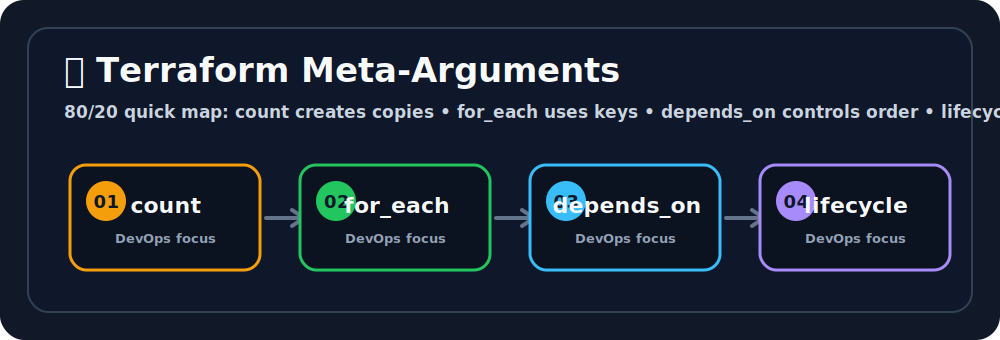

# 🔁 Terraform Meta-Arguments
Ravi, this is the LEGO set for infrastructure, but with fewer missing pieces. 🧱😄


## 🖼️ Quick Visual Summary



> **⚡ 80/20 Summary:** count creates copies • for_each uses keys • depends_on controls order • lifecycle changes behavior

## 1. 🎯 Overview
**Meta-arguments** are special arguments in Terraform that can be applied to any `resource` block regardless of the provider type. They control Terraform's **behavior** when managing that resource — things like creating multiple copies, controlling creation order, and handling lifecycle events. They are the power tools of Terraform.

## 2. 💡 Why This Matters
- **`count` / `for_each`:** Without these, creating 10 EC2 instances means writing 10 identical `resource` blocks. With `for_each`, you declare it once and provide a list.
- **`depends_on`:** Terraform is smart about dependencies, but sometimes the dependency is implicit (e.g., an EC2 instance depends on an IAM policy being attached before it boots). `depends_on` makes this explicit.
- **`lifecycle`:** Prevents accidental production data loss by configuring rules like "never destroy this database even if Terraform says to."

## 3. 🧠 Core Concepts

| Meta-Argument | Purpose |
|---|---|
| `count` | Create N identical copies of a resource |
| `for_each` | Create one resource per item in a map or set |
| `depends_on` | Explicitly declare non-obvious dependencies |
| `lifecycle` | Control create/update/destroy behavior |
| `provider` | Use a specific provider configuration (for multi-region) |

## 4. 🧭 Architecture / Workflow

### `count` vs `for_each` — When to use which?
- Use **`count`** when you need N identical, interchangeable resources (e.g., 3 identical worker nodes).
- Use **`for_each`** when each resource has a unique identity or configuration (e.g., one IAM user per team member with a different name).

> ⚠️ **Critical Difference:** If you remove an item from the middle of a `count` list, Terraform renumbers all subsequent resources and destroys+recreates them. `for_each` uses stable string keys — removing one item only affects that one resource.

## 5. 🛠️ Commands & Practical Usage

After using `count` or `for_each`, target a specific instance:
```bash
# Destroy only the second instance (index 1)
terraform destroy -target='aws_instance.web[1]'

# Destroy a specific for_each resource by key
terraform destroy -target='aws_s3_bucket.buckets["logs"]'
```

## 6. ⚙️ Configuration / Code Examples

### `count` — Create 3 identical EC2 instances:
```hcl
variable "instance_count" {
  type    = number
  default = 3
}

resource "aws_instance" "worker" {
  count         = var.instance_count
  ami           = "ami-0f5ee92e2d63afc18"
  instance_type = "t2.micro"

  tags = {
    # count.index is 0, 1, 2...
    Name = "worker-node-${count.index + 1}"
  }
}

output "worker_ips" {
  # Use [*] to get all IPs as a list
  value = aws_instance.worker[*].public_ip
}
```

---

### `for_each` — Create one S3 bucket per environment:
```hcl
variable "environments" {
  type    = set(string)
  default = ["dev", "staging", "prod"]
}

resource "aws_s3_bucket" "env_buckets" {
  for_each = var.environments
  bucket   = "myapp-${each.key}-artifacts"

  tags = {
    Environment = each.key
  }
}

output "bucket_names" {
  value = { for k, v in aws_s3_bucket.env_buckets : k => v.id }
}
```

---

### `for_each` with a `map` — Create IAM users with specific config per user:
```hcl
variable "iam_users" {
  type = map(object({
    role  = string
    email = string
  }))
  default = {
    "alice" = { role = "developer", email = "alice@company.com" }
    "bob"   = { role = "devops",    email = "bob@company.com"   }
  }
}

resource "aws_iam_user" "team" {
  for_each = var.iam_users
  name     = each.key # "alice", "bob"

  tags = {
    Role  = each.value.role
    Email = each.value.email
  }
}
```

---

### `depends_on` — Force explicit ordering:
```hcl
resource "aws_iam_role_policy_attachment" "s3_access" {
  role       = aws_iam_role.ec2_role.name
  policy_arn = "arn:aws:iam::aws:policy/AmazonS3ReadOnlyAccess"
}

resource "aws_instance" "app" {
  ami           = "ami-0f5ee92e2d63afc18"
  instance_type = "t2.micro"
  iam_instance_profile = aws_iam_instance_profile.ec2_profile.name

  # Without this, Terraform might start the instance before the policy is fully attached
  depends_on = [aws_iam_role_policy_attachment.s3_access]
}
```

---

### `lifecycle` — Protect critical resources from accidental deletion:
```hcl
resource "aws_db_instance" "production" {
  identifier        = "prod-database"
  engine            = "postgres"
  instance_class    = "db.t3.medium"
  allocated_storage = 100
  username          = "admin"
  password          = var.db_password

  lifecycle {
    # CRITICAL: Never let 'terraform destroy' or plan changes delete this DB
    prevent_destroy = true

    # When changing AMI or config that forces replace, create new resource FIRST
    # then destroy old one — avoids temporary downtime
    create_before_destroy = true

    # Ignore future changes to the password field (managed externally by AWS Secrets Manager)
    ignore_changes = [password]
  }
}
```

## 7. 🧪 Hands-on Step-by-Step

**Step 1: Create a project**
```bash
mkdir tf-meta-lab && cd tf-meta-lab
```

**Step 2: Create `main.tf` using `for_each`**
```hcl
terraform {
  required_providers {
    aws = { source = "hashicorp/aws", version = "~> 5.0" }
  }
}

provider "aws" { region = "ap-south-1" }

resource "aws_s3_bucket" "team_buckets" {
  for_each = toset(["dev", "staging", "prod"])
  bucket   = "my-team-bucket-${each.key}-lab-2026"

  tags = {
    Env = each.key
  }
}
```

**Step 3: Init and Plan**
```bash
terraform init
terraform plan
# You will see: Plan: 3 to add (one per environment)
```

**Step 4: Apply and observe**
```bash
terraform apply -auto-approve
# Terraform creates: my-team-bucket-dev, my-team-bucket-staging, my-team-bucket-prod
```

**Step 5: Remove one item and observe targeted destroy**
Remove `"staging"` from the `toset()` list and apply again:
```bash
terraform plan
# Plan: 0 to add, 0 to change, 1 to destroy.
# Only the staging bucket is destroyed — dev and prod are untouched!
```

**Step 6: Clean up**
```bash
terraform destroy -auto-approve
```

## 8. 🚨 Common Errors & Troubleshooting

- **Error: `The "for_each" value depends on resource attributes that cannot be determined until apply`**
  - **Issue:** You are trying to use a value that Terraform doesn't know yet (e.g., an ID that will be created during the same apply) as the key for `for_each`.
  - **Fix:** Use static, known values (like a list of strings defined in a variable) as `for_each` keys. For dynamic keys, use `count` with a list and accept the renumbering trade-off.

- **Error: `Instance cannot be destroyed` (prevent_destroy)**
  - **Issue:** You are trying to `terraform destroy` or making a change that forces replacement on a resource protected by `prevent_destroy = true`.
  - **Fix:** This is working as intended! To intentionally delete the resource, set `prevent_destroy = false`, apply the configuration change, then run destroy.

- **Error: Resources created without `count`/`for_each` but now need it — or vice versa**
  - **Issue:** Adding or removing `count`/`for_each` from an existing resource changes its address in the state (`aws_instance.web` → `aws_instance.web[0]`), causing Terraform to destroy and recreate it.
  - **Fix:** Use `terraform state mv` to rename the resource address in the state file before applying.

## 9. ✅ Best Practices

1. **Prefer `for_each` over `count` for named resources.** It provides stable, meaningful keys and avoids the renumbering problem that causes mass destruction of healthy resources when you remove an item from the middle of a list.
2. **Use `prevent_destroy = true` for all stateful production resources** — databases, S3 buckets with data, Secrets Manager secrets. It acts as a safety net against accidental `terraform destroy`.
3. **Minimize use of `depends_on`.** If you find yourself using it frequently, it usually means your resource references aren't set up correctly. Explicit `resource.attribute` references create implicit dependencies automatically.

## 10. 🎤 Interview Questions & Answers

**Q1: What is the critical difference between `count` and `for_each`?**
**A1:** `count` uses numeric indices (`[0]`, `[1]`). If you remove an item from the middle of the list, Terraform renumbers subsequent resources and destroys+recreates them. `for_each` uses stable string keys — removing one key only destroys that specific resource, leaving all others untouched.

**Q2: When would you use `depends_on` explicitly?**
**A2:** When the dependency is implicit or known only at runtime — for example, your EC2 instance needs an IAM Role Policy fully attached before it boots, but there's no direct resource attribute reference between them that Terraform can automatically detect.

**Q3: What does `create_before_destroy = true` achieve?**
**A3:** When Terraform needs to replace a resource (destroy and recreate), normally it destroys first and then creates — causing downtime. `create_before_destroy` reverses this: it creates the new resource first, then destroys the old one, minimizing disruption.

**Q4: How do you reference the public IP of all instances created via `count`?**
**A4:** Use the splat expression `[*]`: `aws_instance.web[*].public_ip`. This returns a list of all public IPs.

**Q5: You need to create one IAM user per team member, and each user needs a unique path and tag. Should you use `count` or `for_each`?**
**A5:** `for_each` with a map. The map key is the username and the value is an object containing the unique path and tag. This way each user has a stable, meaningful identifier in the state and adding/removing users only affects those specific users.

## 11. ⚡ Quick Revision Summary
- **`count`:** N identical resources. References via `count.index`. Fragile with deletions.
- **`for_each`:** One resource per map/set item. References via `each.key`/`each.value`. Stable.
- **`depends_on`:** Force explicit ordering for non-obvious dependencies.
- **`lifecycle`:** `prevent_destroy`, `create_before_destroy`, `ignore_changes` — safety features.

## 12. 🔗 Official Documentation Links
- [Terraform Meta-Arguments Reference](https://developer.hashicorp.com/terraform/language/meta-arguments/count)
- [The `for_each` Meta-Argument](https://developer.hashicorp.com/terraform/language/meta-arguments/for_each)
- [The `lifecycle` Meta-Argument](https://developer.hashicorp.com/terraform/language/meta-arguments/lifecycle)
