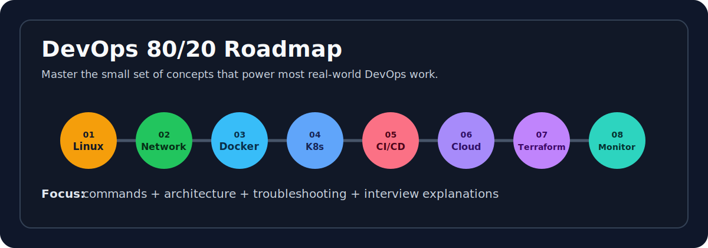

# DevOps 80/20 Interview Notes




Minimal, practical DevOps notes for interviews, hands-on practice, and quick revision.

> **80/20 rule:** learn the 20% of concepts that explain 80% of daily DevOps work.

Ravi, this is the kind of notebook you can revisit later without feeling like it is yelling at you. 😄📚

## Curriculum Map

| # | Module | Focus |
| --- | --- | --- |
| 01 | [Linux](01-Linux) | Filesystem, permissions, processes, logs, networking commands |
| 02 | [Networking](02-Networking) | DNS, HTTP/HTTPS, ports, firewalls, routing, troubleshooting |
| 03 | [Git and GitHub](03-Git-GitHub) | Version control, branches, remotes, pull requests, collaboration |
| 04 | [Docker](04-Docker) | Images, containers, volumes, networks, Compose |
| 05 | [Kubernetes](05-Kubernetes) | Pods, Deployments, Services, updates, networking |
| 06 | [CI/CD](06-CI-CD) | Jenkins, GitHub Actions, pipeline automation |
| 07 | [Cloud](07-Cloud) | AWS infrastructure, VPC, EC2, S3, IAM |
| 08 | [Terraform](08-Terraform) | Providers, state, HCL, variables, modules |
| 09 | [Monitoring](09-Monitoring) | Prometheus, Grafana, metrics, alerts, dashboards |

## What To Master First

| Area | 80/20 Concepts | Must Practice |
| --- | --- | --- |
| Linux | Filesystem, permissions, processes, logs, networking commands | `ls`, `chmod`, `ps`, `systemctl`, `journalctl`, `grep`, `find` |
| Networking | DNS, HTTP/HTTPS, ports, firewalls, routing, load balancing | `ping`, `curl`, `dig`, `nslookup`, `ss`, `traceroute` |
| Git and GitHub | Commits, branches, remotes, PRs, collaboration | `git status`, `git add`, `git commit`, `git push`, `gh pr create` |
| Docker | Images, containers, volumes, networks, Compose | Build, run, debug, push, clean up |
| Kubernetes | Pods, Deployments, Services, ConfigMaps, Secrets, rolling updates | `kubectl get/describe/logs/exec/apply` |
| CI/CD | Pipelines, artifacts, runners, approvals | Build-test-deploy pipeline |
| Cloud | VPC, IAM, EC2, S3, security groups, high availability | Deploy a small app securely |
| Terraform | Providers, state, variables, modules, lifecycle | Create and update infra safely |
| Monitoring | Metrics, logs, alerts, dashboards, SLO basics | Prometheus + Grafana basics |

## Learning Path

```text
01 Linux
   ↓
02 Networking
   ↓
03 Git and GitHub
   ↓
04 Docker
   ↓
05 Kubernetes
   ↓
06 CI/CD
   ↓
07 Cloud
   ↓
08 Terraform
   ↓
09 Monitoring
```

## Notes Index

| Module | Notes |
| --- | --- |
| [01-Linux](01-Linux) | Linux architecture, permissions, processes, networking commands |
| [02-Networking](02-Networking) | DNS/HTTP, ports, firewalls, troubleshooting |
| [03-Git-GitHub](03-Git-GitHub) | Git fundamentals and GitHub collaboration |
| [04-Docker](04-Docker) | Docker images, containers, volumes, networking, Compose |
| [05-Kubernetes](05-Kubernetes) | Architecture, Pods, ReplicaSets, Deployments, Services, updates |
| [06-CI-CD](06-CI-CD) | GitHub Actions, Jenkins pipelines |
| [07-Cloud](07-Cloud) | AWS infrastructure, VPC, EC2, S3, IAM |
| [08-Terraform](08-Terraform) | State, HCL, variables, meta-arguments |
| [09-Monitoring](09-Monitoring) | Prometheus architecture, Grafana dashboards |

## How To Use This Repo

1. Start with the overview and the 80/20 summary in each note.
2. Memorize the core concepts before looking at the commands.
3. Run the commands yourself and break things on purpose.
4. Use the troubleshooting section to practice recovery.
5. Revisit the interview questions before interviews.

## Best Use

Use this repo as a fast revision map, not a textbook. Learn the concept, run the command, understand the failure, then move to the next layer.
